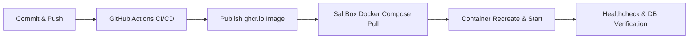

# Repeatable Modern Mylar Deployment & Rollback Workflow

This document defines the authoritative, repeatable workflow for building, publishing, deploying, verifying, and rolling back Modern Mylar releases on SaltBox.

---

## 1. Release Process Overview

Modern Mylar is distributed via immutable, multi-architecture Docker container images published to GitHub Container Registry (`ghcr.io`). Development source trees are never bind-mounted into production or live staging containers.



---

## 2. Image Build and Publication

Containers are built via GitHub Actions (`.github/workflows/build_feature_container.yml`) and tagged with:
- The immutable short commit SHA: `ghcr.io/burnshroom/mylar3:sha-<commit_sha>`
- The versioned release tag: `ghcr.io/burnshroom/mylar3:v3.1.0-modern`
- The branch/tracking tag: `ghcr.io/burnshroom/mylar3:main`

### Build Command (Local / CI)
```bash
docker build -t ghcr.io/burnshroom/mylar3:sha-$(git rev-parse --short HEAD) -f Dockerfile .
```

---

## 3. SaltBox Staging Deployment

### Directory Layout & Volume Preservation
On the SaltBox server, the deployment resides in `/opt/mylar-modern/docker-compose.yml`. Persistent user state is strictly isolated from container layers:
- Configuration & Database: `/opt/mylar-modern/config` &rarr; mounted to `/config` in container (`mylar.db`, `config.ini`, `cache/`, `cbl_imports/`)
- Comic Library: `/comics` &rarr; mounted to `/comics` in container
- Downloads: `/downloads` &rarr; mounted to `/downloads` in container

### Deployment Procedure

1. **Pull the specified immutable image tag**:
   ```bash
   cd /opt/mylar-modern
   docker compose pull
   ```

2. **Recreate and start the service**:
   ```bash
   docker compose up -d --remove-orphans
   ```

3. **Verify running container and image digest**:
   ```bash
   docker compose ps
   docker inspect --format='{{.Image}} {{.State.Status}}' $(docker compose ps -q mylar)
   ```

4. **Verify Application Health & Logs**:
   ```bash
   docker compose logs --tail=100 mylar
   curl -f http://localhost:8090/storyarc_main || echo "Health check failed"
   ```

---

## 4. Rollback Procedure

If a deployed image fails health verification or operational acceptance:

1. **Identify the previous known-good image digest or commit tag** (e.g. `sha-prev_commit` or previous GHCR digest).
2. **Update the image tag in `/opt/mylar-modern/docker-compose.yml`**:
   ```yaml
   services:
     mylar:
       image: ghcr.io/burnshroom/mylar3:sha-known_good_sha
   ```
3. **Execute instantaneous rollback**:
   ```bash
   cd /opt/mylar-modern
   docker compose up -d --force-recreate
   ```
4. **Verify library database integrity**:
   The `/config` directory and database schema remain fully backward-compatible.
