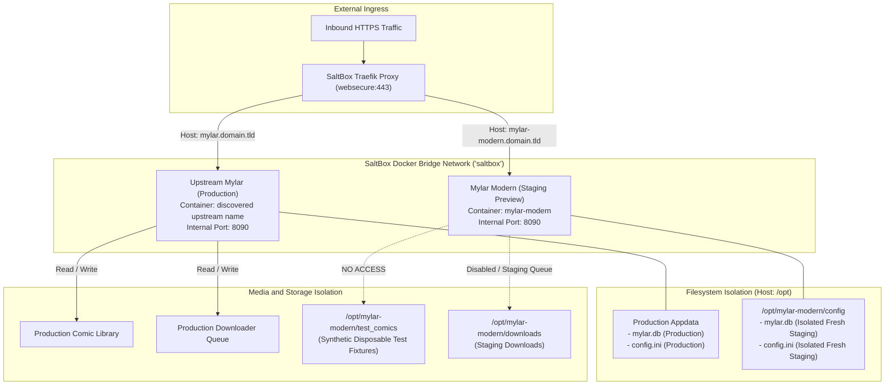

# SaltBox Side-by-Side Staging Architecture & Deployment Guide

> [!IMPORTANT]
> **Status**: `DRAFT — PENDING READ-ONLY HOST DISCOVERY AND SPECIALIZATION`
> Do not deploy or execute on the SaltBox host until read-only host discovery is complete and host-specific variables are supplied.

**Target Service Name**: `mylar-modern`
**Deployment Target**: SaltBox Host (Side-by-Side with Existing Upstream Mylar)
**Publication Source**: `https://github.com/burnshroom/mylar3.1`
**Phase**: D3 Final Corrective Architecture & Deployment Package

---

## 1. Executive Summary & Authoritative Image Provenance

This guide defines the architecture, isolation guarantees, and operational procedures to deploy **Mylar Modern (Creator Identity Preview)** on a SaltBox host beside an existing upstream Mylar installation without disrupting production operations, library files, or databases.

### Authoritative Image Coordinates
- **Registry**: GitHub Container Registry (`ghcr.io`)
- **Repository**: `ghcr.io/burnshroom/mylar3-modern`
- **Immutable Tag**: `sha-f24f784`
- **Manifest Digest**: `sha256:634354bd20f4a5896d1781aa983b309b8f015009bccef21534703f6f961d07b9`
- **Full Immutable Reference**:
  ```text
  ghcr.io/burnshroom/mylar3-modern:sha-f24f784@sha256:634354bd20f4a5896d1781aa983b309b8f015009bccef21534703f6f961d07b9
  ```
- **Target Platform**: `linux/amd64`
- **Package Visibility**: `private` (Pulled via least-privilege token)
- **Runtime Identity**: Non-root UID/GID via dynamic entrypoint privilege dropping (`su-exec`)
- **Internal Service Port**: `8090` (Standard HTTP)

---

## 2. Authoritative Documentation Citations

This deployment design references and adheres to the following official documentation pages:

1. **Custom Containers on SaltBox**:
   - *URL*: [https://docs.saltbox.dev/advanced/your-own-containers/](https://docs.saltbox.dev/advanced/your-own-containers/)
   - *Technical Basis*: SaltBox documents running custom GUI/web applications via standalone Docker Compose in dedicated directories under `/opt/` connected to the internal bridge network.
2. **Traefik Template & Reverse Proxy Integration**:
   - *URL*: [https://docs.saltbox.dev/reference/modules/traefik_template/](https://docs.saltbox.dev/reference/modules/traefik_template/)
   - *Technical Basis*: SaltBox uses Traefik Docker labels for dynamic discovery, distinct routing entrypoints (e.g. `web`, `websecure`), certificate resolvers, and middleware chains.
3. **Docker Environment & Network Conventions**:
   - *URL*: [https://docs.saltbox.dev/apps/docker/](https://docs.saltbox.dev/apps/docker/)
   - *Technical Basis*: SaltBox defines standardized container networking, runtime environment variables, and external network attachment.
4. **SaltBox Directory Structure & Storage Basics**:
   - *URL*: [https://docs.saltbox.dev/basics/directory-structure/](https://docs.saltbox.dev/basics/directory-structure/)
   - *Technical Basis*: SaltBox standardizes `/opt/` for persistent application configuration and `/mnt/` for storage mounts.
5. **GitHub Container Registry Authentication**:
   - *URL*: [https://docs.github.com/en/packages/working-with-a-github-packages-registry/working-with-the-container-registry](https://docs.github.com/en/packages/working-with-a-github-packages-registry/working-with-the-container-registry)
   - *Technical Basis*: Official guidance for authenticating to `ghcr.io` using personal access tokens and Docker credential storage.

### Standalone Compose vs. `saltbox_mod` Selection Rationale
SaltBox provides two mechanisms for custom software:
- **`saltbox_mod`**: Extends the core Ansible playbooks (`saltbox_mod.yml`) with custom roles in `/opt/saltbox_mod/roles/`. This is designed for permanent, long-term system modifications executed during `sb install` and system-wide upgrades.
- **Standalone Docker Compose (Selected)**: Deploying `mylar-modern` as a standalone Compose stack under `/opt/mylar-modern/` is selected for this preview because:
  1. *Strict Blast-Radius Isolation*: It avoids modifying SaltBox playbooks, inventory files, or Ansible roles.
  2. *Independent Lifecycle*: The staging preview can be started, stopped, restarted, upgraded, or removed (`docker compose down`) without triggering or waiting for Ansible playbook runs.
  3. *Risk-Free Decommissioning*: Removing the preview requires zero playbook reconfiguration or inventory rollback.

---

## 3. Side-by-Side Topology & Architecture



---

## 4. Mandatory Isolation Contract

To guarantee zero impact on the production Mylar instance, `mylar-modern` enforces strict isolation boundaries:

| Dimension | Upstream Production Mylar | Staging Mylar Modern (`mylar-modern`) | Isolation Mechanism |
| :--- | :--- | :--- | :--- |
| **Container Name** | Discovered upstream container | `mylar-modern` | Unique Docker container name and hostname |
| **Appdata Directory** | Discovered production appdata | `/opt/mylar-modern/config` | Separate host path mounted to `/config` |
| **Database** | Production `mylar.db` | Fresh staging `mylar.db` | Independent SQLite database; no shared file or mount |
| **Domain / Routing** | `mylar.yourdomain.tld` | `mylar-modern.yourdomain.tld` | Distinct Traefik router rule and separate HTTP/HTTPS middlewares |
| **Traefik Labels** | Production router names | `mylar-modern` router/service names | Distinct label mapping in Traefik |
| **Media Library Mount** | Production library | `/opt/mylar-modern/test_comics` (RO) | Zero access to production comic files |
| **No File Mutations** | Production archive updates | Synthetic fixtures only | No modification of archives or `ComicInfo.xml` |
| **Downloader Queue** | Active production downloader | Disabled initially | Downloader disabled in initial staging config |
| **Host Port Exposure** | Discovered port (or internal) | No host port in primary Compose | Internal routing only; optional loopback-only override |

### SaltBox Backup Management Label (`saltbox_managed`)
SaltBox documentation specifies that the Docker label `com.github.saltbox.saltbox_managed` controls whether SaltBox automated backup jobs stop and restart the container during backup routines.
- In `mylar-modern`, setting `com.github.saltbox.saltbox_managed: "false"` explicitly instructs SaltBox backup routines not to manage this staging container's lifecycle.

### Staging Resource Recommendations
While `deploy.resources` is omitted from the base Compose template to avoid non-Swarm engine incompatibilities, the staging instance is lightweight. Recommended host allocation for staging validation:
- **CPU**: 1 to 2 shared CPU cores
- **Memory**: 512 MB reserved, 2048 MB limit

---

## 5. Private GHCR Authentication Guidance

Because `ghcr.io/burnshroom/mylar3-modern` is a private container package, the SaltBox host Docker daemon must be authenticated with a dedicated, least-privilege token.

### Credential Storage & Security Realities
- **Storage Warning**: By default on Linux without a configured credential helper, Docker stores registry credentials as **base64-encoded plain text** in `~/.docker/config.json`. This is not encrypted storage.
- **Permission Hardening**: Ensure `~/.docker/config.json` is owned by the deploying Unix user and has restrictive file permissions (`chmod 600 ~/.docker/config.json`).
- **Credential Helpers**: If a credential store (such as `pass` or `secretservice`) is configured on the host, Docker will use it automatically.
- **User Context**: Authentication must be performed under the exact Unix user account (e.g. `saltbox`) that runs `docker compose`.
- **Never In Files**: Never place GitHub tokens in `docker-compose.yml`, `.env`, shell profile files, or version control.

### Token Creation & Host Login
1. **Generate Personal Access Token (Classic)**:
   - Go to: [GitHub Settings -> Developer Settings -> Personal Access Tokens -> Tokens (classic)](https://github.com/settings/tokens).
   - Description: `SaltBox mylar-modern pull token`.
   - Scope: Select **ONLY** `read:packages`. Do **NOT** select `repo`, `admin:org`, `write:packages`, or any other permissions.
2. **Execute Silent Login on SaltBox Host**:
   ```bash
   # Read token silently without echoing to terminal or command history
   read -s -p "Enter GHCR Read-Only Token: " GHCR_TOKEN
   echo ""
   echo "$GHCR_TOKEN" | docker login ghcr.io -u burnshroom --password-stdin
   unset GHCR_TOKEN

   # Ensure restrictive permissions on docker config
   chmod 600 ~/.docker/config.json 2>/dev/null || true
   ```
3. **Verify Pull**:
   ```bash
   docker pull ghcr.io/burnshroom/mylar3-modern:sha-f24f784@sha256:634354bd20f4a5896d1781aa983b309b8f015009bccef21534703f6f961d07b9
   ```

---

## 6. Installation & Staging Sequence

### Step 1: Create Staging Directory Structure
On the SaltBox host:
```bash
sudo mkdir -p /opt/mylar-modern/config \
              /opt/mylar-modern/test_comics \
              /opt/mylar-modern/downloads

# Populate synthetic test comic fixture (e.g. sample test CBZ)
sudo touch /opt/mylar-modern/test_comics/.keep

# Set ownership to discovered PUID:PGID (e.g. 1000:1000)
sudo chown -R 1000:1000 /opt/mylar-modern
sudo chmod -R 775 /opt/mylar-modern
```

### Step 2: Configure Environment Variables
Copy and populate `.env`:
```bash
sudo cp docker/saltbox/docker-compose.yml /opt/mylar-modern/docker-compose.yml
sudo cp docker/saltbox/.env.example /opt/mylar-modern/.env

# Edit .env with discovered host parameters (all required variables must be supplied)
sudo nano /opt/mylar-modern/.env
```

### Step 3: Validate Compose Configuration
Before starting the container, verify that all required variables are resolved:
```bash
cd /opt/mylar-modern
docker compose config
```

### Step 4: Start Staging Container
```bash
docker compose up -d
```

---

## 7. Validation Sequence

Execute the following checks in order:

### 1. Container Health & Deterministic Process Identity
Because the container entrypoint uses `exec su-exec` to drop privileges directly to Python, PID 1 inside the container is the Mylar process.
```bash
# Check container status
docker ps --filter "name=mylar-modern"

# Internal Python healthcheck probe status
docker inspect --format '{{.State.Health.Status}}' mylar-modern

# Deterministic process command-line inspection on PID 1
docker exec mylar-modern sh -c "tr '\0' ' ' < /proc/1/cmdline"

# Deterministic UID/GID status on PID 1
docker exec mylar-modern grep -E '^(Uid|Gid):' /proc/1/status
```

### 2. Initial Downloader Disabled Verification
Verify that `mylar-modern` initializes with no active downloader:
```bash
# Verify client and torrent downloader settings in created config.ini
grep -E '^(nzb_downloader|torrent_downloader|enable_torznab|newznab) =' /opt/mylar-modern/config/config.ini
```
*Expected Values*: `nzb_downloader = 3` (None), `enable_torznab = False`, `newznab = False`.

### 3. Traefik Routing & Authentication
```bash
# Query the staging subdomain
# Expected: HTTP 200 (direct access) or HTTP 302 (redirect to Authelia/Authentik login portal)
curl -s -I https://mylar-modern.yourdomain.tld/home
```

### 4. Upstream Production Mylar Sanity Check
```bash
# Confirm production Mylar remains healthy and unaffected
docker ps --filter "name=<discovered-upstream-name>"
curl -s -I https://mylar.yourdomain.tld/home
```

---

## 8. Database Staging & Future Migration Protocol

### Initial Staging Contract (Phase D3)
- Initial staging runs strictly with a **fresh, empty staging database** initialized by `mylar-modern` in `/opt/mylar-modern/config/mylar.db`.
- All tests use synthetic comic fixtures in `/opt/mylar-modern/test_comics`.
- Downloader integrations remain disabled.
- **Zero production database copying or mounting is performed during this phase.**

### Controlled Future Migration Protocol (Future Phase Only)
If a future phase authorizes testing against production-derived metadata, it must follow one of these two safe methods:
1. **SQLite Online Backup API**:
   ```bash
   # Perform online backup without stopping the writer
   sqlite3 /path/to/prod/mylar.db ".backup /opt/mylar-modern/config/mylar.db"
   ```
2. **Verified Full Shutdown & Cold Copy**:
   - Completely stop upstream Mylar (`docker stop <mylar-container>`).
   - Verify that WAL (`mylar.db-wal`) and SHM (`mylar.db-shm`) files are checkpointed or copied together.
   - Copy to staging: `cp /path/to/prod/mylar.db /opt/mylar-modern/config/mylar.db`.
   - Restart upstream Mylar immediately.
   - Set ownership on staging copy: `chown 1000:1000 /opt/mylar-modern/config/mylar.db`.
- **Golden Rule**: Any migrated database is strictly a disposable staging copy. The production database is **never migrated in place**.

---

## 9. Rollback & Recoverable Decommissioning Procedure

To uninstall `mylar-modern` without risking data loss:

### Step 1: Stop and Remove Container
```bash
cd /opt/mylar-modern
docker compose down
```

### Step 2: Archive & Quarantine Staging Data
```bash
# Create dated archive of staging state
sudo tar -czvf /opt/mylar-modern-quarantine-$(date +%Y%m%d%H%M%S).tar.gz -C /opt mylar-modern

# Move staging directory to an exact dated quarantine location (do NOT use destructive wildcards)
sudo mv /opt/mylar-modern /opt/mylar-modern-quarantined-$(date +%Y%m%d)
```

### Step 3: Verify Production Invariants
```bash
# Verify upstream Mylar is running with zero errors
docker ps --filter "name=<discovered-upstream-name>"
curl -s -I https://mylar.yourdomain.tld/home
```

### Step 4: Permanent Deletion (Separate User-Approved Action)
Permanent deletion is a separate, destructive maintenance action performed only after:
1. Verification of the exact resolved quarantine directory path.
2. Confirmation that the staging archive exists.
3. Expiration of the established data retention period.
4. Explicit user review and authorization.
