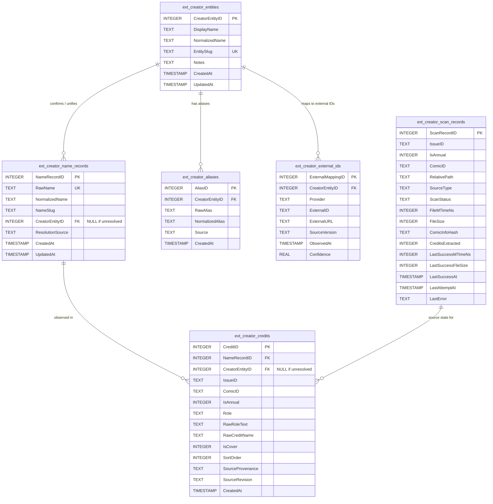

# Phase C1.1 — Creator Data Model & Migration Design (Corrected)

## Executive Summary

This document establishes the corrected, implementation-ready creator data model, schema migration specification, archive change detection signature, and background job architecture for Mylar.

### Core Architectural Principles
1. **Names Are Not Identities**: A shared or identical name string in `ComicInfo.xml` is never treated as proof of identity. Raw observed names and confirmed creator identities are strictly decoupled.
2. **Failure-Safe Credit Retention**: A failed, corrupt, or inaccessible rescan never deletes previously indexed known-good credits. Credits are replaced atomically only after a verified successful parse of changed source metadata.
3. **100% Core Table Invariance**: Core tables (`issues`, `annuals`, `comics`, `storyarcs`) remain 100% untouched. All creator capabilities are extension-owned under `mylar.extensions.creators`.
4. **Provider Neutrality & Provenance Coexistence**: Canonical creator entities contain zero provider-specific columns. Local `ComicInfo.xml` metadata, Metron data, and ComicVine credits coexist as distinct provenance records.
5. **Conservative Delimiter Boundary**: Automatic splitting is strictly limited to commas (`,`) and semicolons (`;`). Conjunctions (`and`, `&`, `/`) are never automatically split.
6. **Defensive, User-Initiated Background Worker**: Scans run exclusively when explicitly commanded by the user with cooperative cancellation between archives and a default batch limit of 50 archives. Never runs on startup, page load, or ordinary browsing.

---

## 1. Extension Ownership & Migration Integration

### 1.1 Ownership Boundary
All creator tables, parsers, query services, and background workers reside exclusively in the extension package:

```text
mylar/extensions/
  migrations/
    runner.py
    versions/
      creators.py              <-- Additive, idempotent extension migration
  creators/
    __init__.py
    schema.py                  <-- Table DDL, column definitions, & indices
    indexer.py                 <-- Safe archive reader & signature checker
    normalizer.py              <-- Strict delimiter parser & search slug generator
    worker.py                  <-- Cancellable background job manager & status tracking
    service.py                 <-- Query API for UI & issue inspector
    controller.py              <-- WebInterface routes
```

### 1.2 Migration Execution Rules
- **Registration**: Registered in [`mylar/extensions/migrations/runner.py`](file:///c:/Users/spike/.gemini/antigravity/scratch/mylar3_1/mylar/extensions/migrations/runner.py).
- **Idempotency**: All DDL uses `CREATE TABLE IF NOT EXISTS` and `CREATE INDEX IF NOT EXISTS`.
- **No Request-Handler DDL**: Migrations execute exclusively during startup migration checks, never inside CherryPy web request handlers.
- **Foreign Key Agnosticism**: Schema does not rely on SQLite foreign key enforcement (`PRAGMA foreign_keys = ON`) being active; all queries use explicit joins and application-level defensive cleanup.
- **Error Handling**: Follows established M1 behavior: logs error at `ERROR` level, safely closes cursor/connection handles, and re-raises to prevent corrupted partial state.

### 1.3 Core Table Isolation
- Core tables (`issues`, `annuals`, `comics`) remain completely un-modified.
- Extension junction tables reference core `IssueID` and `ComicID` values without adding columns or foreign key constraints to core tables.

---

## 2. Table Matrix & Corrected Schema Specification



### 2.1 Complete DDL Specification

```sql
-- ============================================================================
-- 1. Observed Raw Name Records (Decoupled from Confirmed Identities)
-- ============================================================================
CREATE TABLE IF NOT EXISTS ext_creator_name_records (
    NameRecordID        INTEGER PRIMARY KEY AUTOINCREMENT,
    RawName             TEXT UNIQUE NOT NULL,        -- Exact string from XML/source (e.g. 'Frank Cho', 'Stan Lee & Jack Kirby')
    NormalizedName      TEXT NOT NULL,               -- Lowercase unaccented search text (e.g. 'frank cho')
    NameSlug            TEXT NOT NULL,               -- Search/route convenience slug (e.g. 'frank-cho')
    CreatorEntityID     INTEGER DEFAULT NULL REFERENCES ext_creator_entities(CreatorEntityID) ON DELETE SET NULL,
    ResolutionSource    TEXT NOT NULL DEFAULT 'unresolved', -- 'unresolved', 'manual_user', 'provider_metron', 'provider_comicvine'
    CreatedAt           TIMESTAMP DEFAULT CURRENT_TIMESTAMP,
    UpdatedAt           TIMESTAMP DEFAULT CURRENT_TIMESTAMP
);

-- ============================================================================
-- 2. Confirmed Creator Entities (Authoritative Identity Records)
-- ============================================================================
CREATE TABLE IF NOT EXISTS ext_creator_entities (
    CreatorEntityID     INTEGER PRIMARY KEY AUTOINCREMENT,
    DisplayName         TEXT NOT NULL,               -- Authoritative display name
    NormalizedName      TEXT NOT NULL,               -- Lowercase unaccented search text
    EntitySlug          TEXT UNIQUE NOT NULL,        -- Unique slug (e.g. 'frank-cho-1')
    Notes               TEXT DEFAULT NULL,           -- Biographical or disambiguation notes
    CreatedAt           TIMESTAMP DEFAULT CURRENT_TIMESTAMP,
    UpdatedAt           TIMESTAMP DEFAULT CURRENT_TIMESTAMP
);

-- ============================================================================
-- 3. Creator Name Aliases & Variations
-- ============================================================================
CREATE TABLE IF NOT EXISTS ext_creator_aliases (
    AliasID             INTEGER PRIMARY KEY AUTOINCREMENT,
    CreatorEntityID     INTEGER NOT NULL REFERENCES ext_creator_entities(CreatorEntityID) ON DELETE CASCADE,
    RawAlias            TEXT NOT NULL,               -- Explicit alias (e.g. 'F. Cho', 'Frank Cho, Jr.')
    NormalizedAlias     TEXT NOT NULL,               -- Lowercase search alias (e.g. 'f cho')
    Source              TEXT NOT NULL DEFAULT 'user',-- 'comicinfo', 'metron', 'comicvine', 'user'
    CreatedAt           TIMESTAMP DEFAULT CURRENT_TIMESTAMP,
    UNIQUE(CreatorEntityID, NormalizedAlias)
);

-- ============================================================================
-- 4. Provider-Neutral External ID Mappings
-- ============================================================================
CREATE TABLE IF NOT EXISTS ext_creator_external_ids (
    ExternalMappingID   INTEGER PRIMARY KEY AUTOINCREMENT,
    CreatorEntityID     INTEGER NOT NULL REFERENCES ext_creator_entities(CreatorEntityID) ON DELETE CASCADE,
    Provider            TEXT NOT NULL,               -- 'metron', 'comicvine', 'gcd', 'leagueofcomicgeeks'
    ExternalID          TEXT NOT NULL,               -- Provider unique key (e.g. '4005-12345', '789')
    ExternalURL         TEXT DEFAULT NULL,           -- Direct link to provider web page
    SourceVersion       TEXT DEFAULT NULL,           -- Provider payload version
    ObservedAt          TIMESTAMP DEFAULT CURRENT_TIMESTAMP,
    Confidence          REAL DEFAULT 1.0,            -- Match confidence score (0.0 to 1.0)
    UNIQUE(Provider, ExternalID)
);

-- ============================================================================
-- 5. Issue Creator Credits (Relational Junction)
-- ============================================================================
CREATE TABLE IF NOT EXISTS ext_creator_credits (
    CreditID            INTEGER PRIMARY KEY AUTOINCREMENT,
    NameRecordID        INTEGER NOT NULL REFERENCES ext_creator_name_records(NameRecordID) ON DELETE CASCADE,
    CreatorEntityID     INTEGER DEFAULT NULL REFERENCES ext_creator_entities(CreatorEntityID) ON DELETE SET NULL,
    IssueID             TEXT NOT NULL,               -- Foreign key to issues.IssueID or annuals.IssueID
    ComicID             TEXT NOT NULL,               -- Foreign key to comics.ComicID
    IsAnnual            INTEGER NOT NULL DEFAULT 0,  -- 0 = Regular Issue, 1 = Annual
    Role                TEXT NOT NULL,               -- Controlled vocabulary: 'writer', 'penciller', 'inker', 'colorist', 'letterer', 'editor', 'cover_artist', 'other'
    RawRoleText         TEXT NOT NULL,               -- Source role label (e.g. 'Story & Art', 'Variant Cover')
    RawCreditName       TEXT NOT NULL,               -- Raw name string as parsed from source
    IsCover             INTEGER NOT NULL DEFAULT 0,  -- 1 if cover art credit, 0 if interior
    SortOrder           INTEGER NOT NULL DEFAULT 0,  -- Ordinal sequence position within the role in source
    SourceProvenance    TEXT NOT NULL,               -- 'comicinfo', 'metron', 'comicvine'
    SourceRevision      TEXT NOT NULL,               -- File signature or content hash of parsed source
    CreatedAt           TIMESTAMP DEFAULT CURRENT_TIMESTAMP,
    UNIQUE(IssueID, IsAnnual, SourceProvenance, Role, SortOrder, RawCreditName)
);

-- ============================================================================
-- 6. Current Source State & Scan Records
-- ============================================================================
CREATE TABLE IF NOT EXISTS ext_creator_scan_records (
    ScanRecordID        INTEGER PRIMARY KEY AUTOINCREMENT,
    IssueID             TEXT NOT NULL,
    IsAnnual            INTEGER NOT NULL DEFAULT 0,
    ComicID             TEXT NOT NULL,
    RelativePath        TEXT NOT NULL,               -- Safe library-relative archive path (never absolute/UNC)
    SourceType          TEXT NOT NULL,               -- 'comicinfo', 'metron', 'comicvine'
    ScanStatus          TEXT NOT NULL,               -- 'scanned_with_credits', 'scanned_no_credits', 'no_comicinfo', 'inaccessible_or_unsupported', 'pending_or_stale'
    FileMTimeNs         INTEGER NOT NULL DEFAULT 0,  -- High-resolution filesystem modification time in integer nanoseconds
    FileSize            INTEGER NOT NULL DEFAULT 0,  -- Archive file size in bytes
    ComicInfoHash       TEXT DEFAULT NULL,           -- SHA256 of extracted ComicInfo.xml stream (optional)
    CreditsExtracted    INTEGER NOT NULL DEFAULT 0,  -- Count of credits parsed
    LastSuccessMTimeNs  INTEGER DEFAULT 0,           -- FileMTimeNs of last successful credit extraction
    LastSuccessFileSize INTEGER DEFAULT 0,           -- FileSize of last successful credit extraction
    LastSuccessAt       TIMESTAMP DEFAULT NULL,      -- Timestamp of last successful parse
    LastAttemptAt       TIMESTAMP DEFAULT CURRENT_TIMESTAMP, -- Timestamp of last scan attempt
    LastError           TEXT DEFAULT NULL,           -- Error/diagnostic message if scan failed
    UNIQUE(IssueID, IsAnnual, SourceType)
);

-- ============================================================================
-- Performance Indexes
-- ============================================================================
CREATE INDEX IF NOT EXISTS idx_ext_names_raw ON ext_creator_name_records(RawName);
CREATE INDEX IF NOT EXISTS idx_ext_names_norm ON ext_creator_name_records(NormalizedName);
CREATE INDEX IF NOT EXISTS idx_ext_names_slug ON ext_creator_name_records(NameSlug);
CREATE INDEX IF NOT EXISTS idx_ext_names_entity ON ext_creator_name_records(CreatorEntityID);
CREATE INDEX IF NOT EXISTS idx_ext_creators_slug ON ext_creator_entities(EntitySlug);
CREATE INDEX IF NOT EXISTS idx_ext_creators_norm ON ext_creator_entities(NormalizedName);
CREATE INDEX IF NOT EXISTS idx_ext_aliases_norm ON ext_creator_aliases(NormalizedAlias);
CREATE INDEX IF NOT EXISTS idx_ext_extids_creator ON ext_creator_external_ids(CreatorEntityID);
CREATE INDEX IF NOT EXISTS idx_ext_extids_lookup ON ext_creator_external_ids(Provider, ExternalID);
CREATE INDEX IF NOT EXISTS idx_ext_credits_name ON ext_creator_credits(NameRecordID);
CREATE INDEX IF NOT EXISTS idx_ext_credits_creator ON ext_creator_credits(CreatorEntityID);
CREATE INDEX IF NOT EXISTS idx_ext_credits_issue ON ext_creator_credits(IssueID, IsAnnual);
CREATE INDEX IF NOT EXISTS idx_ext_credits_comic ON ext_creator_credits(ComicID);
CREATE INDEX IF NOT EXISTS idx_ext_credits_role ON ext_creator_credits(Role);
CREATE INDEX IF NOT EXISTS idx_ext_scan_lookup ON ext_creator_scan_records(IssueID, IsAnnual, SourceType);
CREATE INDEX IF NOT EXISTS idx_ext_scan_status ON ext_creator_scan_records(ScanStatus);
```

---

## 3. Creator Identity Model: Names $\neq$ Identities

### 3.1 Observed Names vs. Confirmed Identities
1. **Raw Observed Names (`ext_creator_name_records`)**:
   - Represents the exact string parsed from local `ComicInfo.xml`.
   - Allows immediate search, filtering, and cross-issue navigation across all local archives without asserting that two similarly named strings belong to the same person.
   - `CreatorEntityID` is initially `NULL` (`ResolutionSource = 'unresolved'`).
2. **Confirmed Entities (`ext_creator_entities`)**:
   - Represents a verified individual person.
   - Created and linked to name records only when verified through:
     - Authoritative external provider mapping (e.g. Metron `creator_id` or ComicVine `person_id`);
     - Explicit user confirmation / merge in the UI; or
     - Documented, non-heuristic exact-match rules.
3. **Prevention of False Merges**:
   - Two distinct creators who happen to share a name (or have composite tags like `"Stan Lee & Jack Kirby"`) remain distinct name records.
   - Normalization text (`NormalizedName`) and slugs (`NameSlug`) are strictly search and route helpers, never durable identity keys.

### 3.2 Creator Browser Query Behavior
A future Creator Browser UI operates with 3 transparent query modes:
- **Raw Name View (Default)**: Shows all issues containing the exact credited name (e.g. `"Frank Cho"`).
- **Confirmed Entity View**: When a name record is linked to a confirmed `CreatorEntityID`, shows all issues credited across all linked aliases and variations.
- **Unresolved State Indicator**: UI displays a clear visual badge (`Unverified Local Credit`) when a name record has `CreatorEntityID IS NULL`, indicating to the user that credits reflect raw archive text without verified external identity.

---

## 4. Scan-State Semantics & Failure Protection

### 4.1 Scan State Model
`ext_creator_scan_records` tracks the complete lifecycle and history of every archive scan using discrete timestamp and signature fields:

| Field | Type | Description |
|---|---|---|
| `LastAttemptAt` | `TIMESTAMP` | Timestamp of the most recent scan attempt (success or failure). |
| `LastSuccessAt` | `TIMESTAMP` | Timestamp of the most recent *successful* parse. |
| `LastSuccessMTimeNs` | `INTEGER` | Integer nanosecond mtime of the file at the time of last success. |
| `LastSuccessFileSize` | `INTEGER` | Byte size of the file at the time of last success. |
| `FileMTimeNs` | `INTEGER` | High-resolution filesystem modification time (`os.stat().st_mtime_ns`). |
| `FileSize` | `INTEGER` | Filesystem byte count (`os.stat().st_size`). |
| `ScanStatus` | `TEXT` | `scanned_with_credits`, `scanned_no_credits`, `no_comicinfo`, `inaccessible_or_unsupported`, `pending_or_stale`. |
| `LastError` | `TEXT` | Diagnostic error string if the last scan attempt failed. |

### 4.2 Failure Protection Rules
1. **Never Delete on Failure**: If an archive scan fails (file inaccessible, locked, corrupt zip stream, unrar error), `ScanStatus` is set to `inaccessible_or_unsupported` and `LastError` is recorded. **All previously extracted credits in `ext_creator_credits` are preserved intact.**
2. **Atomic Replacement on Success Only**: Existing credits for an issue/source are deleted and replaced in a single atomic SQLite transaction **only after** `ComicInfo.xml` has been fully and successfully read and parsed into memory.
3. **Valid Non-Credit Outcomes**:
   - `no_comicinfo`: Archive is a valid zip/rar file, but contains no `ComicInfo.xml`. Existing credits are cleared atomically (as the file legitimately lacks metadata), `ScanStatus` is set to `no_comicinfo`, and `LastSuccessAt` is updated. This is a valid scan, not an error.
   - `scanned_no_credits`: `ComicInfo.xml` exists, but contains no creator tags. Handled as a valid clean result.
4. **Safe Path Storage**: `RelativePath` stores library-relative paths only (e.g. `DC Comics/Batman (2011)/Batman 001 (2011).cbz`). Runtime path resolution is delegated to `mylar.extensions.thumbnails.resolver.resolve_issue_file`.

---

## 5. Credit Fingerprinting & Conservative Parsing Boundary

### 5.1 Stable Credit Uniqueness
Credit uniqueness in `ext_creator_credits` is constrained by:
```sql
UNIQUE(IssueID, IsAnnual, SourceProvenance, Role, SortOrder, RawCreditName)
```
- Preserves ordinal sequence (`SortOrder`) as defined in the source XML.
- Prevents silent collapse of distinct credits while safely collapsing byte-for-byte identical duplicates within the same role.

### 5.2 Conservative Parsing Rules
1. **Delimiters**: Split exclusively on commas `,` and semicolons `;`.
2. **Suffix Protection**: Merge suffixes (`Jr.`, `Sr.`, `II`, `III`, `IV`, `Ph.D.`) back into preceding name tokens.
3. **No Conjunction Splitting**: `and`, `&`, `/`, and `with` are **never** automatically split.
   - Example: `<Writer>Scott Snyder and Nick Dragotta</Writer>` creates a single name record for `"Scott Snyder and Nick Dragotta"`. It is never split into two presumed names during local indexing.
4. **Zero Provider Guessing**: No live ComicVine calls, Metron queries, or heuristic title matching occurs during local indexing. Local indexing is 100% offline.

---

## 6. C2 Background Worker Readiness

### 6.1 Worker Architecture: `mylar.extensions.creators.worker.CreatorIndexWorker`
- Runs in a dedicated background `threading.Thread`.
- Checks `self._stop_event.is_set()` **between archives**. Cancellation terminates the scan cooperatively at the next archive boundary.
- Emits thread-safe structured JSON status:

```json
{
  "job_id": "creator-idx-1724410000",
  "status": "running",
  "attempted": 14,
  "succeeded_with_credits": 10,
  "succeeded_without_credits": 1,
  "no_comicinfo": 3,
  "inaccessible": 0,
  "skipped_unchanged": 12,
  "cancelled": false,
  "current_file": "Batman 015 (2012).cbz",
  "error_log": []
}
```

### 6.2 Strict Execution Boundaries
- **No Automatic Scans**: Indexer never runs automatically on startup, page load, or during browsing.
- **Initial Scope**: Scans only an explicitly selected series (`ComicID`) or selected issue IDs (`issueids`).
- **Batch Limit**: Multi-series / library-wide scans are gated behind an explicit confirmation modal with a default batch limit of **50 archives per run**.

---

## 7. Before / After Design Comparison Matrix

| Architectural Dimension | Phase C1 Draft | Phase C1.1 Approved Design |
|---|---|---|
| **Creator Identity** | Name matched directly to `ext_creator_entities`; identical display names assumed to be the same person. | **Strict Decoupling**: Raw names stored in `ext_creator_name_records`. `ext_creator_entities` reserved exclusively for confirmed identities linked via external provider IDs or explicit user action. |
| **Search vs Identity** | Slugs/Normalized names used as entity identity anchors. | `NormalizedName` and `NameSlug` used strictly for search and routing; never treated as identity proof. |
| **Scan Failure Behavior** | Failure state tracked in scan record without explicit retention guarantees. | **Explicit Retention**: Failed or inaccessible scans record `LastError` but **never delete known-good credits**. Credits replaced atomically on success only. |
| **File Modification Time** | Floating point `FileMTime REAL`. | High-resolution integer nanoseconds `FileMTimeNs INTEGER` (`os.stat().st_mtime_ns`). |
| **Scan State Lifecycle** | Single `LastScannedAt` timestamp. | Explicit separation of `LastAttemptAt`, `LastSuccessAt`, `LastSuccessMTimeNs`, `LastSuccessFileSize`, and `LastError`. |
| **Credit Uniqueness** | `(CreatorID, IssueID, IsAnnual, Role, SourceProvenance)`. | `(IssueID, IsAnnual, SourceProvenance, Role, SortOrder, RawCreditName)`. Prevents silent collapse of multi-person or composite credits. |
| **Conjunction Parsing** | Ambiguous conjunctions flagged conceptually. | Explicit rule: `and`, `&`, `/` are **never** automatically split. Stored intact as unparsed raw-name records. |
| **Worker Execution** | Promised sub-50ms fixed cancellation. | Realistic cooperative cancellation checked between archives; strict default 50-archive batch limit. |

---

## 8. C1.1 Approved Design for C2

The following specifications are finalized and approved for Phase C2 implementation:

### 1. Final Table List
1. `ext_creator_name_records` (Raw observed names, search normalization, resolution status).
2. `ext_creator_entities` (Confirmed individual creator identities).
3. `ext_creator_aliases` (Explicit creator alias mappings).
4. `ext_creator_external_ids` (Provider-neutral external keys for Metron, ComicVine, etc.).
5. `ext_creator_credits` (Relational junction linking name records and confirmed entities to issues by role).
6. `ext_creator_scan_records` (Scan lifecycle, integer nanosecond timestamps, and error diagnostics).

### 2. Identity-Resolution Rules
- Local indexing populates `ext_creator_name_records` and `ext_creator_credits` with `CreatorEntityID = NULL` (`ResolutionSource = 'unresolved'`).
- No entity merges or provider ID links are established without authoritative external IDs or user confirmation.

### 3. Scan Replacement & Failure Rules
- Failed scans update `LastAttemptAt`, `ScanStatus = 'inaccessible_or_unsupported'`, and `LastError`. Existing credits remain untouched.
- Successful scans delete and recreate credits in a single atomic transaction.
- `no_comicinfo` and `scanned_no_credits` are valid outcomes, not errors.

### 4. Explicit Deferred Items
- Metron API integration $\rightarrow$ Deferred to Phase C4.
- ComicVine person matching $\rightarrow$ Deferred to Phase C4.
- Automated alias suggestion algorithms $\rightarrow$ Deferred to Phase C4.
- Library-wide automatic polling $\rightarrow$ Strictly prohibited.

### 5. Exact C2 Implementation Boundary
1. Create `mylar.extensions.migrations.versions.creators` with all 6 tables and indexes; register in `runner.py`.
2. Implement `mylar.extensions.creators` package (`schema.py`, `indexer.py`, `normalizer.py`, `worker.py`, `service.py`, `controller.py`).
3. Add front-facing **Index Creators** action to Modern Series Details with live progress/cancellation modal.
4. Verify on sample series (e.g. Fight Girls, Batgirl, Amazing X-Men) with zero database mutations to core tables and zero remote network requests.
