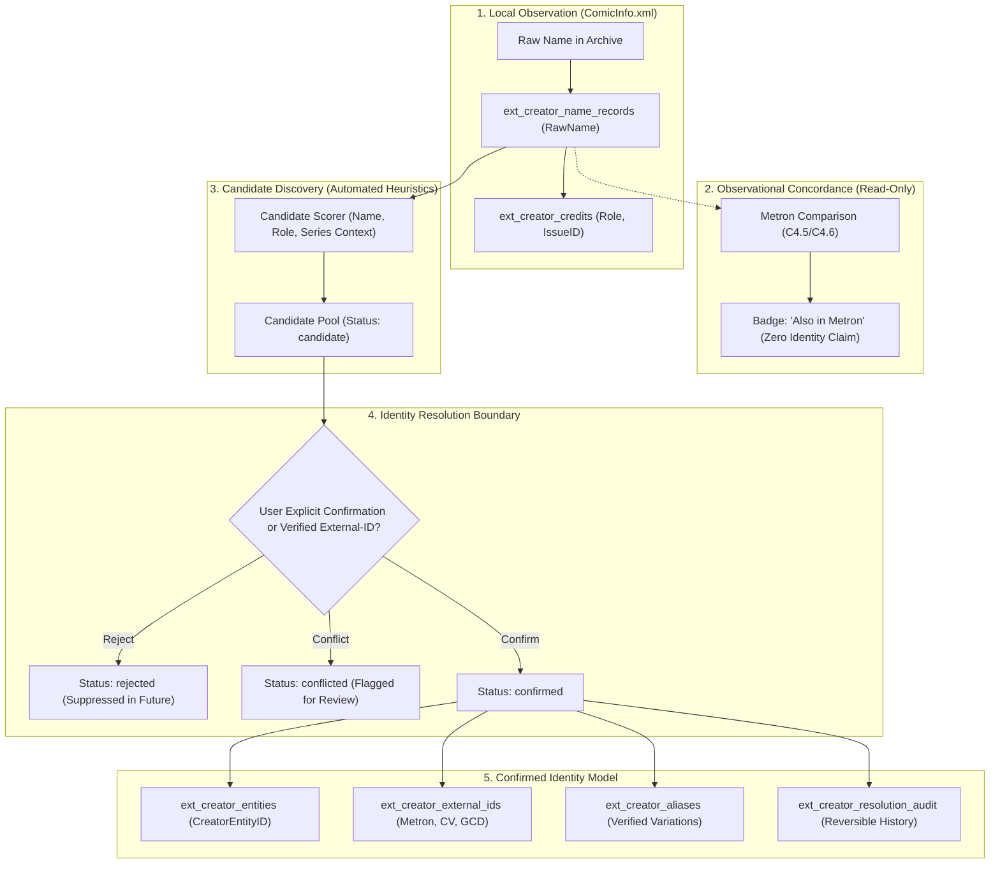
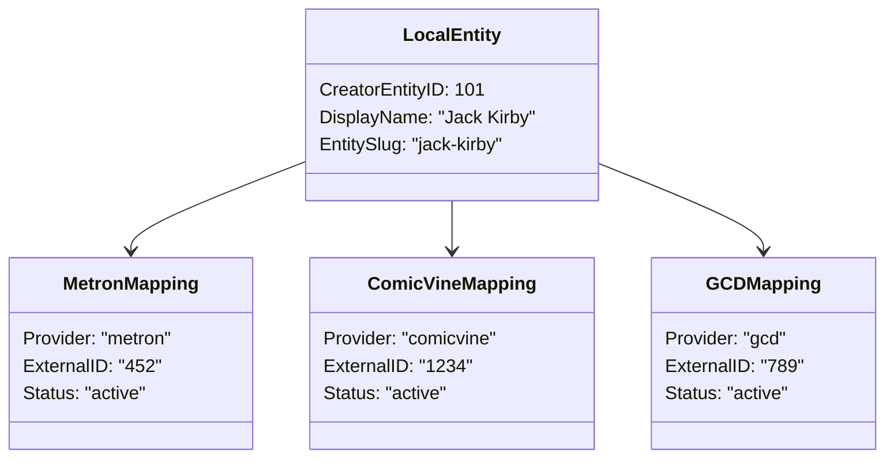

# Phase C4.7 — Creator Identity Resolution and Provider Linkage Design (Read-Only)

## Executive Summary

This specification defines a conservative, deterministic, and fully reversible architecture for resolving locally observed comic creator credits (`ComicInfo.xml`) to confirmed creator identities, provider records (Metron, ComicVine, GCD), and aliases.

### Core Identity Tenet
**Names and roles are observations, not identities.**
Under no circumstances does string equality, normalization agreement, slug matching, role concordance, or provider overlap constitute identity proof. All automated processes terminate at candidate scoring; promoting a candidate to a confirmed identity requires an existing verified external-ID mapping or an explicit user confirmation.



---

## 1. Current-State Audit of Implementation & Data Contracts

### 1.1 Existing Creator Schema (`mylar/extensions/migrations/versions/creators.py`)

The local creator subsystem operates across six extension-owned SQLite tables:

| Table | Purpose | Primary Key | Key Uniqueness & Constraints | Current Identity Semantics |
| :--- | :--- | :--- | :--- | :--- |
| `ext_creator_name_records` | Raw observed creator name strings extracted from archives. | `NameRecordID` (INTEGER) | `RawName` UNIQUE | Unresolved by default (`ResolutionSource = 'unresolved'`, `CreatorEntityID = NULL`). Points to entity only when linked. |
| `ext_creator_entities` | Canonical confirmed creator persons. | `CreatorEntityID` (INTEGER) | `EntitySlug` UNIQUE | Represents a distinct real-world creator. Populated only upon confirmation. |
| `ext_creator_aliases` | Verified name variations and pseudonyms. | `AliasID` (INTEGER) | `UNIQUE(CreatorEntityID, NormalizedAlias)` | Connects alternate name strings to a canonical `CreatorEntityID`. |
| `ext_creator_external_ids` | Provider identifiers (Metron, ComicVine, GCD). | `ExternalMappingID` (INTEGER) | `UNIQUE(Provider, ExternalID)` | Connects a `CreatorEntityID` to a single provider namespace ID. |
| `ext_creator_credits` | Relational junction between archives and creator records. | `CreditID` (INTEGER) | `UNIQUE(IssueID, IsAnnual, SourceProvenance, Role, SortOrder, RawCreditName)` | Links `IssueID` and `NameRecordID`. `CreatorEntityID` is optionally cached for join acceleration. |
| `ext_creator_scan_records` | Source file metadata hashes and scan tracking. | `ScanRecordID` (INTEGER) | `UNIQUE(IssueID, IsAnnual, SourceType)` | Tracks `FileMTimeNs`, `FileSize`, `ComicInfoHash` for safe change detection. |

### 1.2 Creator Browser & Detail Services (`mylar/extensions/creators/`)
- **`CreatorBrowserService.get_creator_detail(name_record_id)`**: Loads appearances and issue credits strictly keyed by `NameRecordID`. If `CreatorEntityID` is NULL, it truthful presents the record as `UNLINKED`.
- **`CreatorBrowserService.get_issue_creator_credits(issue_id, is_annual)`**: Retrieves local issue credits joined with `ext_creator_name_records`.

### 1.3 Metron Normalization & Comparison Pipeline (`mylar/extensions/providers/metron/`)
- **`normalize_metron_credit(credit_entry, order)`** in `normalizer.py`:
  - Parses raw provider creator dictionaries.
  - Extracts `metron_creator_id`, `comicvine_creator_id`, `gcd_creator_id`, `raw_creator_name`, `raw_role_text`, `canonical_role`, and `order`.
- **`normalize_metron_issue(raw_issue_data, query_cv_id)`** in `normalizer.py`:
  - Aggregates normalized credits into `provider_snapshot['credits']`.
- **`compare_with_local_credits(provider_snapshot, local_credits)`** in `comparison.py`:
  - In-memory matching engine strictly evaluating exact string equality between `raw_creator_name` and `canonical_role`.
  - Returns `exact_overlaps`, `local_only_credits`, `provider_only_credits`, and `role_discrepancies`.

### 1.4 Explicit Audit Finding: Metron Creator ID Lifecycle

| Lifecycle Phase | Field Status | Exact Code Reference | Details |
| :--- | :--- | :--- | :--- |
| **1. API Ingestion & Extraction** | **Retained** | `normalizer.py:93-107` | `id`, `cv_id`, and `gcd_id` are parsed from the `creator` object in raw Metron JSON responses. |
| **2. Issue Normalization** | **Retained** | `normalizer.py:151-160` | `metron_creator_id`, `comicvine_creator_id`, and `gcd_creator_id` are populated in every normalized credit item in `provider_snapshot['credits']`. |
| **3. In-Memory Comparison** | **Retained** | `comparison.py:85-123` | Matched and unmatched provider credit dictionaries (`p_cred`) are preserved verbatim inside `exact_overlaps[i]['provider_credit']`, `provider_only_credits[i]`, and `role_discrepancies[i]['provider_credit']`. |
| **4. Runtime Service Output** | **Retained** | `comparison_service.py:181-194` | The complete `provider_snapshot` and structured credit lists containing provider creator IDs are returned in the `/metronCompareCredits` JSON response. |
| **5. Database Persistence** | **Zero Persistence** | `comparison_service.py:1-195` | Provider creator IDs are **NOT** written to SQLite, **NOT** stored in `ext_creator_external_ids`, and **NOT** used to automatically link `NameRecordID` to `CreatorEntityID`. |

**Conclusion**: Metron creator IDs are **retained throughout normalization and in-memory comparison**, but are **strictly isolated from database storage and entity linkage** in the current architecture.

---

## 2. Identity Governance Rules

The resolution architecture must strictly enforce all ten identity governance rules:

1. **Candidate Evidence Only**: Normalized display-name and role agreement constitutes observational candidate evidence only. It never establishes identity proof.
2. **Provider Namespace Authority**: A provider creator ID (e.g. Metron Creator ID `452`) is authoritative solely within that provider's namespace. It cannot be assumed to equal a ComicVine or GCD ID without explicit verification.
3. **Display Name Separation**: Two name records with identical display names (e.g., two distinct individuals named `Jack Miller`) remain completely separate entities unless explicitly linked by a user.
4. **Transformations Never Prove Identity**: Case folding (`FRANK CHO` vs `Frank Cho`), punctuation stripping (`Deodato, Jr.` vs `Deodato Jr`), suffix normalization, or slug equality (`john-byrne`) never prove identity.
5. **No Automatic Composite Splitting**: Composite credit strings containing conjunctions or delimiters (`and`, `&`, `/`, `with`, `feat.`) are never automatically split into multiple individual identities.
6. **No Heuristic Alias Inference**: Aliases are never inferred from name similarity. An alias mapping requires explicit confirmation.
7. **Strict Confirmation Gating**: A creator entity may be confirmed only via:
   - an existing, verified external-ID mapping; or
   - an explicit user confirmation action.
8. **Permanent Rejection Retention**: A candidate match rejected by the user remains rejected in perpetuity across rescans and re-comparisons, unless deliberately reopened.
9. **Provider Mutation Invariance**: Upstream provider changes (renaming a creator, updating an ID, reassigning credits) must never silently overwrite or mutate confirmed local identity links.
10. **Full Auditability & Reversibility**: Every confirmation, rejection, replacement, and reversal must be logged with timestamp, initiating actor, previous state, and rationale.

---

## 3. Resolution-State Model & Transition Matrix

### 3.1 State Definitions

```text
               ┌──────────────────────┐
               │  observed_unlinked   │
               └──────────┬───────────┘
                          │ (Automatic discovery)
                          ▼
               ┌──────────────────────┐
               │      candidate       │◄─────────────────┐
               └────┬────────────┬────┘                  │
   (User Confirm)   │            │ (User Reject)         │ (User Re-open)
   ┌────────────────┘            └────────────────┐      │
   ▼                                              ▼      │
┌──────────────┐                            ┌────────────┴─┐
│  confirmed   │                            │   rejected   │
└──────┬───────┘                            └──────────────┘
       │ (Conflicting data detected)
       ▼
┌──────────────┐
│  conflicted  │
└──────────────┘
```

- **`observed_unlinked`**: Raw name observed in `ComicInfo.xml`. No identity link exists; no candidates currently active.
- **`candidate`**: Potential entity or provider match proposed by heuristic matching (name/role/series). Purely ephemeral observation; **zero database entity linkage**.
- **`confirmed`**: An explicit, verified relationship connecting a `NameRecordID` to a `CreatorEntityID`, and/or connecting a `CreatorEntityID` to an `ExternalID`.
- **`rejected`**: Candidate match explicitly rejected by user or system rule. Suppressed from default recommendation views.
- **`conflicted`**: Contradictory evidence discovered (e.g., duplicate external IDs claimed by different entities, or local credits in direct opposition to provider records).

### 3.2 State-Transition Matrix

| Source State | Target State | Initiating Event | Required Evidence | DB Effects (Future Phase) | Transition Mode | Reversibility |
| :--- | :--- | :--- | :--- | :--- | :--- | :--- |
| `[None]` | `observed_unlinked` | Archive metadata indexed | `ComicInfo.xml` creator tag present | Insert `ext_creator_name_records` (`CreatorEntityID = NULL`) | **Automatic** | Rescan / credit purge |
| `observed_unlinked` | `candidate` | Provider comparison or local entity search | Normalized name / role similarity match | In-memory candidate scored or inserted into candidate cache | **Automatic** | Automatic (ephemeral) |
| `candidate` | `confirmed` | User confirms candidate in UI | Explicit user confirmation click | Update `ext_creator_name_records.CreatorEntityID`, insert `ext_creator_external_ids`, write audit record | **User-Confirmed** | Fully reversible via `Undo` |
| `observed_unlinked` | `confirmed` | User creates new entity for record | Explicit user creation click | Insert `ext_creator_entities`, link `NameRecordID`, write audit record | **User-Confirmed** | Fully reversible via `Undo` |
| `candidate` | `rejected` | User rejects candidate match | Explicit user rejection click | Insert `ext_creator_candidate_rejections`, write audit record | **User-Confirmed** | Reversible via `Re-open Candidate` |
| `confirmed` | `observed_unlinked` | User reverses confirmation | Explicit user undo action | Set `ext_creator_name_records.CreatorEntityID = NULL`, write audit record | **User-Confirmed** | Reversible via re-confirmation |
| `confirmed` | `conflicted` | Upstream ID collision detected | Two local entities claiming same provider ID | Set `ext_creator_external_ids.Status = 'conflicted'`, flag UI | **Automatic Gate** | Resolved by user confirmation |
| `conflicted` | `confirmed` | User resolves conflict | Explicit selection of authoritative entity | Remove invalid mapping, set status to `active`, write audit | **User-Confirmed** | Fully reversible |

---

## 4. Provider Linkage Model (`ext_creator_external_ids`)

### 4.1 Extended External ID Attributes

To support multi-provider linkage without ambiguous identity claims, `ext_creator_external_ids` will be utilized with the following structured attributes:

```sql
-- Logical representation of provider linkage attributes in ext_creator_external_ids
-- (To be supported via minimal additive fields in Phase C4.8)
Provider            TEXT NOT NULL,          -- e.g. 'metron', 'comicvine', 'gcd'
ExternalID          TEXT NOT NULL,          -- Provider primary ID string (e.g. '1054')
ExternalURL         TEXT,                   -- Canonical link (e.g. 'https://metron.cloud/creator/...')
ConfirmationSource  TEXT NOT NULL,          -- 'user_explicit', 'verified_propagation'
ConfirmedAt         TIMESTAMP NOT NULL,     -- UTC timestamp of confirmation
ConfirmedBy         TEXT NOT NULL,          -- Username or 'admin'
LastObservedAt      TIMESTAMP,              -- Timestamp of most recent provider check
ProviderDisplayName TEXT NOT NULL,          -- Name string on provider at confirmation time
Status              TEXT NOT NULL           -- 'active', 'superseded', 'rejected', 'conflicted'
```

### 4.2 Handling Complex Edge Cases



1. **One Local Entity with IDs from Multiple Providers**:
   - Multiple rows in `ext_creator_external_ids` share the same `CreatorEntityID` with different `Provider` values (`metron`, `comicvine`, `gcd`).
2. **Two Local Entities Claiming the Same Provider ID**:
   - The database constraint `UNIQUE(Provider, ExternalID)` prevents duplicate active rows.
   - If an incoming confirmation conflicts with an existing entity, the system blocks the update and transitions the candidate to `conflicted`.
3. **One Observed Name Producing Multiple Provider Candidates**:
   - The UI lists all candidates ordered by evidence score (exact role overlap, shared series context, co-creator graph). The user must explicitly choose one or reject all.
4. **Provider Changes Creator's Display Name**:
   - The confirmed link remains intact via immutable `ExternalID`.
   - `ProviderDisplayName` records the historical name; `LastObservedAt` updates on refresh. Local `ext_creator_entities.DisplayName` is **never** silently rewritten.
5. **External ID Disappearing or Reassigned by Provider**:
   - If a provider lookup returns 404 or points to a completely different person, the mapping is marked `conflicted` with an explanation. Existing local credits remain intact.
6. **Stale Cached Comparison Data**:
   - In-memory provider snapshots obey the established TTL (24h). Confirming an identity always validates the current provider state before persisting the link.
7. **Provider-Role Disagreements**:
   - Local `Role` (e.g. `Inker`) and Provider `Role` (e.g. `Penciller`) are recorded independently. Role disagreement never invalidates an identity link, but is surfaced in the discrepancy report.

---

## 5. Reversible Confirmation Workflow

The identity resolution journey consists of eight auditable, non-destructive steps:

```text
[Step 1: View Observed Credit]
  └── User navigates to Creator Detail page (NameRecordID=42, RawName='Mike Deodato')

[Step 2: Candidate Discovery & Review]
  └── System presents Candidate Drawer:
      ├── Candidate A: Mike Deodato Jr. (Metron ID: 1205, Score: 95%, Match: Name + Role + Series)
      └── Candidate B: Mike Deodato Sr. (Metron ID: 3410, Score: 40%, Match: Name Only)

[Step 3: User Action Choice]
  ├── [Option A: Confirm Candidate A] ────────► Promotes Candidate A to confirmed
  ├── [Option B: Reject All Candidates] ─────► Marks Candidate A & B as rejected
  └── [Option C: Create Independent Entity] ──► Creates new local entity 'Mike Deodato'

[Step 4: Execute Confirmation]
  └── DB writes:
      1. ext_creator_name_records.CreatorEntityID = 101
      2. ext_creator_external_ids: (101, 'metron', '1205', 'active')
      3. ext_creator_resolution_audit: Log INSERT action

[Step 5: Optional Alias Attachment]
  └── User explicitly prompted: "Register 'Mike Deodato' as an alias for 'Mike Deodato Jr.'?"
      └── If Yes: Insert into ext_creator_aliases

[Step 6: Reversal / Undo Action]
  └── User clicks "Undo Linkage" on Creator Detail page:
      1. ext_creator_name_records.CreatorEntityID = NULL
      2. ext_creator_external_ids remains or transitions to superseded
      3. ext_creator_resolution_audit: Log REVERSAL action
```

### Safety Invariants
- **No Cascade Deletions**: Unlinking an identity never deletes comic issues, scan records, or archive metadata.
- **No Automatic Name Merges**: Raw name records (`ext_creator_name_records`) retain their original immutable `RawName` strings forever.

---

## 6. Conflict Handling & Ambiguity Matrix

| Ambiguity Scenario | Example | Deterministic System Policy | Resulting State |
| :--- | :--- | :--- | :--- |
| **1. Homonyms (Different People)** | `Jack Miller` (1940s Writer) vs `Jack Miller` (Modern Colorist) | Retain separate `NameRecordID` entries. Require distinct `CreatorEntityID` records. Do not merge. | `observed_unlinked` until user assigns separate entities |
| **2. Suffix Variants** | `Mike Deodato Jr.` vs `Mike Deodato` | Offer as high-confidence candidate. Require explicit user confirmation before aliasing. | `candidate` |
| **3. Initials vs Full Names** | `J. Michael Straczynski` vs `Joe Straczynski` | Treat as candidate only if co-creator/series context matches. Never auto-alias. | `candidate` |
| **4. Pseudonyms** | `Stan Lee` vs `Stanley Lieber` | Retain raw credits as published. Connect via `ext_creator_aliases` under entity `Stan Lee`. | `confirmed` via alias mapping |
| **5. Studios / Corporates** | `Digital Chameleon`, `Comicraft`, `Studio F` | Identify as studio entity via entity type attribute (`is_organization`). Never split into individuals. | `confirmed` entity (Studio) |
| **6. Composite Credits** | `Scott Snyder and Nick Dragotta` | **Never split automatically.** Present as single composite credit. User may manually link if desired. | `observed_unlinked` (Composite) |
| **7. Diacritics & Accents** | `Enki Bilal` vs `Énki Bilal` | Normalized slug matches for search indexing, but entity linkage requires user verification. | `candidate` |
| **8. Multi-Role Creator** | `Frank Miller` (Writer + Penciller + Cover) | Linked `CreatorEntityID` applies across all credit roles without duplicating the person entity. | `confirmed` (Multi-role) |
| **9. Upstream ID Collision** | Metron ID `999` claimed by Entity 1 and Entity 2 | Block new assignment. Surface both entities in Conflict Resolution center. | `conflicted` |
| **10. Source Metadata Conflict** | `ComicInfo.xml` = `Inker`; Metron = `Penciller` | Maintain local `ComicInfo.xml` credit as canonical. Show Metron role difference in observation panel. | `confirmed` entity + observational diff |

---

## 7. Future Service and API Boundaries (`mylar.extensions.creators`)

All resolution endpoints will reside in the extension package with thin routing delegates in `webserve.py`:

```mermaid
flowchart LR
    Client[Web Interface / AJAX] --> Webserve[mylar/webserve.py (Thin Delegate)]
    Webserve --> Router[mylar/extensions/creators/controller.py]
    Router --> CandSvc[CandidateService]
    Router --> ResSvc[ResolutionService]
    Router --> AuditSvc[AuditService]
    CandSvc --> DB[(SQLite Mylar DB)]
    ResSvc --> DB
    AuditSvc --> DB
```

### 7.1 Endpoint Specifications

#### 1. `GET /creatorCandidates`
- **Purpose**: Retrieve scored candidate entities and provider records for a local name record.
- **Parameters**: `name_record_id` (int, required), `limit` (int, optional, default=10).
- **Response**:
```json
{
  "success": true,
  "name_record_id": 42,
  "raw_name": "Mike Deodato",
  "candidates": [
    {
      "candidate_id": "cand_metron_1205",
      "provider": "metron",
      "provider_creator_id": "1205",
      "provider_name": "Mike Deodato Jr.",
      "score": 0.92,
      "match_reasons": ["name_similarity:0.88", "shared_series:Amazing X-Men", "role_concordance:penciller"],
      "existing_entity_id": 101,
      "status": "candidate"
    }
  ]
}
```

#### 2. `POST /creatorConfirmMapping`
- **Purpose**: Explicitly link a name record to an entity and/or provider ID.
- **Parameters**: `name_record_id` (int), `entity_id` (int, optional), `provider` (str, optional), `external_id` (str, optional), `create_alias` (bool), `csrf_token` (str).
- **Validation**: Strict CSRF verification, state transition check (rejects if conflicted), duplicate ID prevention.
- **Idempotency**: Supported via `idempotency_key`.

#### 3. `POST /creatorRejectCandidate`
- **Purpose**: Permanently suppress a candidate match from recommendations.
- **Parameters**: `name_record_id` (int), `provider` (str), `external_id` (str), `reason` (str), `csrf_token` (str).

#### 4. `POST /creatorReverseConfirmation`
- **Purpose**: Reversibly disconnect an entity linkage and restore unlinked observation state.
- **Parameters**: `name_record_id` (int), `reason` (str), `csrf_token` (str).

#### 5. `GET /creatorAuditHistory`
- **Purpose**: Retrieve complete chronological audit trail for a name record or entity.
- **Parameters**: `name_record_id` (int, optional), `creator_entity_id` (int, optional).

---

## 8. UI Design Boundaries & Presentation Concepts

```text
┌────────────────────────────────────────────────────────────────────────────────────────┐
│ CREATOR DETAIL: Mike Deodato                                   [ UNLINKED ]            │
├────────────────────────────────────────────────────────────────────────────────────────┤
│ ℹ️ Credit Identity Status                                                               │
│ This name is currently unlinked. Credits reflect raw archive metadata.                 │
│                                                                                        │
│ ┌─ CANDIDATE IDENTITIES (2 Found) ───────────────────────────────────────────────────┐ │
│ │ • Mike Deodato Jr.  [Metron ID: 1205] (92% Confidence)                             │ │
│ │   Evidence: Exact match on Amazing X-Men penciller credits.                         │ │
│ │   [ Confirm Identity ]   [ Reject Candidate ]   [ View Provider Evidence ]         │ │
│ │                                                                                    │ │
│ │ • Mike Deodato Sr.  [Metron ID: 3410] (40% Confidence)                             │ │
│ │   Evidence: Name similarity only (Different era).                                  │ │
│ │   [ Confirm Identity ]   [ Reject Candidate ]                                      │ │
│ └────────────────────────────────────────────────────────────────────────────────────┘ │
│                                                                                        │
│ [ Create New Standalone Entity ]   [ View Audit History ]                              │
└────────────────────────────────────────────────────────────────────────────────────────┘
```

### Strict Terminology Separation
- **`Also in Metron`**: Purely observational credit concordance at issue inspection time. **Zero identity claim.**
- **`Candidate identity`**: Heuristic recommendation presented for user evaluation. **Zero entity linkage.**
- **`Confirmed identity`**: Explicitly verified real-world creator link (`CreatorEntityID`).
- **`Conflicting identity evidence`**: Multi-entity collision or metadata contradiction requiring manual resolution.

---

## 9. Minimal Schema Assessment

### 9.1 Evaluation of Current 6-Table Schema
The current schema established in Phase C2 can support basic entity links (`ext_creator_name_records.CreatorEntityID`), aliases (`ext_creator_aliases`), and external IDs (`ext_creator_external_ids`).

However, to support **permanent rejection suppression**, **comprehensive audit logging**, and **rich external-ID statuses**, the following minimal, additive schema additions are proposed for a future implementation phase (Phase C4.8):

### 9.2 Proposed Minimal Additive Schema (Specification for Future Phase C4.8)

```sql
-- 1. Explicit Candidate Rejections (Suppresses rejected suggestions)
CREATE TABLE IF NOT EXISTS ext_creator_candidate_rejections (
    RejectionID         INTEGER PRIMARY KEY AUTOINCREMENT,
    NameRecordID        INTEGER NOT NULL,
    Provider            TEXT NOT NULL,
    ExternalID          TEXT NOT NULL,
    RejectedBy          TEXT NOT NULL DEFAULT 'user',
    RejectedAt          TIMESTAMP DEFAULT CURRENT_TIMESTAMP,
    Reason              TEXT DEFAULT NULL,
    UNIQUE(NameRecordID, Provider, ExternalID)
);
CREATE INDEX IF NOT EXISTS idx_ext_rejections_lookup 
ON ext_creator_candidate_rejections(NameRecordID, Provider, ExternalID);

-- 2. Immutable Resolution Audit Log (Full Reversibility)
CREATE TABLE IF NOT EXISTS ext_creator_resolution_audit (
    AuditID             INTEGER PRIMARY KEY AUTOINCREMENT,
    NameRecordID        INTEGER,
    CreatorEntityID     INTEGER,
    Action              TEXT NOT NULL, -- 'CONFIRM', 'REJECT', 'REVERSE', 'CREATE_ENTITY', 'ALIAS_ADD'
    PreviousStateJson   TEXT,
    NewStateJson        TEXT,
    PerformedBy         TEXT NOT NULL,
    PerformedAt         TIMESTAMP DEFAULT CURRENT_TIMESTAMP,
    Rationale           TEXT DEFAULT NULL
);
CREATE INDEX IF NOT EXISTS idx_ext_audit_namerec ON ext_creator_resolution_audit(NameRecordID);
CREATE INDEX IF NOT EXISTS idx_ext_audit_entity ON ext_creator_resolution_audit(CreatorEntityID);
```

---

## 10. Required Test Matrix for Future Implementation

| # | Test Scenario | Expected Invariant / Outcome |
| :--- | :--- | :--- |
| **1** | `Frank Cho` and `FRANK CHO` raw name records | Kept as separate observed records; normalizing creates candidate link, not auto-merge. |
| **2** | Two distinct creators with the same name (`Jack Miller`) | Separate `NameRecordID` and `CreatorEntityID` records; zero cross-contamination. |
| **3** | Suffix variants (`Mike Deodato Jr.` vs `Mike Deodato`) | Scored as candidate; requires explicit confirmation click before entity/alias linkage. |
| **4** | Composite credit (`Scott Snyder and Nick Dragotta`) | Preserved as single credit; zero automated splitting into separate creator entities. |
| **5** | Same normalized name, different roles (Writer vs Penciller) | Retains both credit roles under single entity upon confirmation without role mutation. |
| **6** | Same provider ID offered to two local entities | Second confirmation blocked with `conflict_detected` error; status set to `conflicted`. |
| **7** | Multiple provider candidates for one observed name | Returns complete candidate array; selecting candidate A marks candidate B as unselected. |
| **8** | Explicit confirmation followed by reversal | Unlink restores `NameRecordID.CreatorEntityID = NULL`; audit table logs both operations. |
| **9** | Rejected candidate across re-comparisons | Candidate remains suppressed in future `/creatorCandidates` responses. |
| **10** | Provider display name change | `ExternalID` link remains intact; local `DisplayName` is preserved without overwrite. |
| **11** | Disabled / unconfigured Metron integration | Candidate discovery fails closed; returns empty candidate array with zero network calls. |
| **12** | Stale comparison cache expiration | Expired cache forces re-fetch on demand; confirmed entity mappings remain invariant. |
| **13** | Read-only candidate browsing | Browsing candidates performs zero SQLite database write queries (`SELECT` only). |
| **14** | Stored evidence inspection | Viewing stored candidates performs zero provider API network requests. |

---

## 11. Implementation Sequence for Future Phases

```text
Phase C4.7: Architecture & Data Contract Design (Current Phase - Read-Only Document)
    │
    ▼
Phase C4.8: Additive Audit Schema Migration & Candidate Scoring Service
    ├── Migration: ext_creator_candidate_rejections, ext_creator_resolution_audit
    └── Service: CandidateService (Heuristic scoring & candidate evaluation)
    │
    ▼
Phase C4.9: Resolution Engine, Reversal Controller & Audit Endpoints
    ├── Service: ResolutionService (Confirm, Reject, Undo, Conflict Resolution)
    └── Controller: /creatorCandidates, /creatorConfirmMapping, /creatorReverseConfirmation
    │
    ▼
Phase C5.0: Modern Identity Management UI
    ├── Creator Detail Identity & Candidate Review Panel
    ├── Conflict Resolution Screen
    └── Reversible History & Audit Log Viewer
```

---

## 12. Verification and Invariance Guarantee

- **Database Invariance**: Zero SQLite write transactions executed during design phase.
- **Provider Invariance**: Zero live external network requests to Metron, ComicVine, or GCD.
- **Filesystem Invariance**: Zero modifications to comic archives, `ComicInfo.xml`, or library structures.
- **Codebase Invariance**: Only `creator_identity_resolution_design.md` created.
