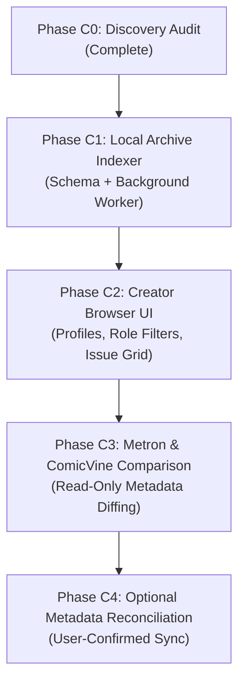

# Phase C0 — Creator Metadata & Local Archive Indexing Audit

## Executive Summary

This read-only discovery audit investigates Mylar's current creator metadata capabilities, analyzes a representative sample of 35 downloaded comic archives across `.cbz` and `.cbr` formats (including regular Issues and Annuals), maps existing code paths, and designs a candidate extension-owned schema and safe indexing workflow for a future Creator Browser.

---

## 1. Existing Data Sources & Capability Map

### 1.1 SQLite Database (`mylar.db`)
An exhaustive audit of all SQLite tables in `mylar.db` confirms:
- **`issues`**: Contains 21 columns (`IssueID`, `ComicName`, `IssueName`, `Issue_Number`, `DateAdded`, `Status`, `Type`, `ComicID`, `ArtworkURL`, `ReleaseDate`, `Location`, `IssueDate`, `DigitalDate`, `Int_IssueNumber`, `ComicSize`, `AltIssueNumber`, `IssueDate_Edit`, `ImageURL`, `ImageURL_ALT`, `forced_file`, `inCacheDIR`). **Zero creator columns.**
- **`annuals`**: Contains 18 columns (`IssueID`, `Issue_Number`, `IssueName`, `IssueDate`, `Status`, `ComicID`, `GCDComicID`, `Location`, `ComicSize`, `Int_IssueNumber`, `ComicName`, `ReleaseDate`, `DigitalDate`, `ReleaseComicID`, `ReleaseComicName`, `IssueDate_Edit`, `DateAdded`, `Deleted`). **Zero creator columns.**
- **`comics`**: Contains 50 series-level metadata columns (`ComicID`, `ComicName`, `ComicYear`, `ComicPublisher`, `Description`, etc.). **Zero creator columns.**
- **`storyarcs`**, **`storyarc_manifests`**, **`readlist`**, **`snatched`**, **`weekly`**: **Zero creator columns.**

**Finding**: Mylar currently does not store creator metadata (writers, pencillers, inkers, colorists, letterers, editors, or cover artists) in any persistent database table.

---

### 1.2 Local Archive Metadata (`ComicInfo.xml` / `ComicBookInfo`)
Creator metadata exists locally only inside downloaded `.cbz` (zip) and `.cbr` (rar) comic archives as embedded XML (`ComicInfo.xml`) or zip comment dictionaries (`ComicBookInfo/1.0`).

- **`ComicInfo.xml` Standard Tags**:
  - `<Writer>`
  - `<Penciller>`
  - `<Inker>`
  - `<Colorist>`
  - `<Letterer>`
  - `<Editor>`
  - `<CoverArtist>`
  - `<StoryArc>` & `<StoryArcNumber>` (optional)
- **Tag Format**: Raw, unnormalized string (e.g. comma-delimited list of names, occasional semicolons or conjunctions).

---

### 1.3 Existing Mylar Code Paths & Helper Functions

1. **`mylar.helpers.IssueDetails(filelocation, IssueID=None, justinfo=False, comicname=None)`**:
   - Located in [`mylar/helpers.py:1262`](file:///c:/Users/spike/.gemini/antigravity/scratch/mylar3_1/mylar/helpers.py#L1262).
   - If `filelocation` is provided:
     - When `justinfo=False`, calls `getimage.extract_image(filelocation, single=True, imquality='issue', comicname=comicname)`.
     - Extracts `ComicInfo.xml` from `.cbz` via `zipfile.ZipFile` or from `.cbr` via `rarfile.RarFile`.
     - Parses XML with `xml.dom.minidom.parseString` into dictionary fields: `writer`, `penciller`, `inker`, `colorist`, `letterer`, `editor`, `cover_artist`, `summary`, etc.
   - If `filelocation` is `None` or absent:
     - **Live Provider Fallback**: Calls `mylar.cv.getComic(None, 'single_issue', IssueID)` to fetch live issue details from ComicVine.
     - Parses live credits array `meta_data['credits']` into role lists.
     - **Limitation**: Makes an un-cached, blocking network request to ComicVine.

2. **`mylar.webserve.issueInspector(issueid)`**:
   - Located in [`mylar/webserve.py:7880`](file:///c:/Users/spike/.gemini/antigravity/scratch/mylar3_1/mylar/webserve.py#L7880).
   - Resolves archive path from `issues.Location` / `annuals.Location`.
   - Calls `helpers.IssueDetails(filepath, IssueID=issueid)`.
   - Converts raw strings or ComicVine credits into template lists (`issuewriter`, `issuepenciller`, `issueletterer`, `issueeditor`, `issueinker`, `issuecolorist`, `issuecoverartist`).
   - Serves the data on-demand to the Modern Issue Inspector popup (`#issue-box`).
   - **Limitation**: Ephemeral read; no persistence, indexing, or relational querying.

---

## 2. Local Archive Sample Analysis

A representative sample of **35 downloaded comic archives** was analyzed across multiple publishers, formats (`.cbz` and `.cbr`), and book types (regular Issues and Annuals) from staging storage.

### 2.1 Sample Coverage Table

| # | Series / Title | Publisher | Book Type | Ext | ComicInfo.xml | Writer | Penciller | Inker | Colorist | Letterer | Editor | Cover Artist |
|---|---|---|---|---|---|---|---|---|---|---|---|---|
| 1 | Amazing X-Men #1 | Marvel | Regular | .cbz | **Yes** | Fabian Nicieza | Andy Kubert | Matt Ryan | Kevin Somers | Comicraft, Richard Starkings | Bob Harras | Andy Kubert |
| 2 | Amazing X-Men #2 | Marvel | Regular | .cbz | **Yes** | Fabian Nicieza | Andy Kubert | Matt Ryan | Digital Chameleon, Kevin Somers | Comicraft, Richard Starkings | Bob Harras | Andy Kubert |
| 3 | Amazing X-Men #3 | Marvel | Regular | .cbz | **Yes** | Fabian Nicieza | Andy Kubert | Matt Ryan | Digital Chameleon, Kevin Somers | Comicraft, Richard Starkings | - | Andy Kubert |
| 4 | Amazing X-Men #4 | Marvel | Regular | .cbz | **Yes** | Fabian Nicieza | Andy Kubert | Matt Ryan | Digital Chameleon, Kevin Somers | Comicraft, Richard Starkings | Bob Harras | Andy Kubert |
| 5 | Fight Girls #1 | AWA Studios | Regular | .cbz | **Yes** | Frank Cho | Frank Cho | Frank Cho | Sabine Rich | Sal Cipriano | - | Frank Cho, Mike Deodato Jr. |
| 6 | Fight Girls #2 | AWA Studios | Regular | .cbz | **Yes** | Frank Cho | Frank Cho | Frank Cho | Sabine Rich | Sal Cipriano | - | Frank Cho |
| 7 | Fight Girls #3 | AWA Studios | Regular | .cbz | **Yes** | Frank Cho | Frank Cho | Frank Cho | Sabine Rich | Sal Cipriano | - | Frank Cho, Sabine Rich |
| 8 | Fight Girls #4 | AWA Studios | Regular | .cbz | **Yes** | Frank Cho | Frank Cho | Frank Cho | Sabine Rich | Sal Cipriano | - | Frank Cho, Sabine Rich |
| 9 | Fight Girls #5 | AWA Studios | Regular | .cbz | **Yes** | Frank Cho | Frank Cho | Frank Cho | Sabine Rich | Sal Cipriano | - | Frank Cho, Sabine Rich |
| 10 | Batgirl #1 | DC Comics | Regular | .cbz | **Yes** | Gail Simone | Ardian Syaf | Vicente Cifuentes | Ulises Arreola | Dave Sharpe | Bobbie Chase, Katie Kubert | Adam Hughes |
| 11 | Batgirl #2 | DC Comics | Regular | .cbz | **Yes** | Gail Simone | Ardian Syaf | Vicente Cifuentes | Ulises Arreola | Dave Sharpe | Bobbie Chase, Katie Kubert | Adam Hughes |
| 12 | Batgirl #3 | DC Comics | Regular | .cbz | **Yes** | Gail Simone | Ardian Syaf | Vicente Cifuentes | Ulises Arreola | Dave Sharpe | Bobbie Chase, Katie Kubert | Adam Hughes |
| 13 | Batgirl #4 | DC Comics | Regular | .cbz | **Yes** | Gail Simone | Ardian Syaf | Vicente Cifuentes | Ulises Arreola | Dave Sharpe | Bobbie Chase, Katie Kubert | Adam Hughes |
| 14 | Batgirl #6 | DC Comics | Regular | .cbz | **Yes** | Gail Simone | Ardian Syaf, Ardian Syaf *(dup)* | Vicente Cifuentes | Ulises Arreola | Dave Sharpe | Bobbie Chase, Katie Kubert | Adam Hughes |
| 15 | Batgirl #7 | DC Comics | Regular | .cbz | **Yes** | Gail Simone | Alitha E. Martinez, Ardian Syaf *(dups)* | Vicente Cifuentes | Ulises Arreola | Dave Sharpe | Bobbie Chase, Katie Kubert | Ardian Syaf, Ulises Arreola, Vicente Cifuentes |
| 16 | Batman: The Dark Knight #1 | DC Comics | Regular | .cbr | **No** | - | - | - | - | - | - | - |
| 17 | Batman: The Dark Knight #5 | DC Comics | Regular | .cbr | **No** | - | - | - | - | - | - | - |
| 18 | Batman: The Dark Knight #11 | DC Comics | Regular | .cbr | **No** | - | - | - | - | - | - | - |
| 19 | Batman: The Dark Knight #14 | DC Comics | Regular | .cbr | **No** | - | - | - | - | - | - | - |
| 20 | Batman: The Dark Knight #15 | DC Comics | Regular | .cbr | **No** | - | - | - | - | - | - | - |
| 21 | Batman: The Dark Knight #17 | DC Comics | Regular | .cbr | **No** | - | - | - | - | - | - | - |
| 22 | Batman: The Dark Knight #20 | DC Comics | Regular | .cbr | **No** | - | - | - | - | - | - | - |
| 23 | Batman: The Dark Knight #21 | DC Comics | Regular | .cbr | **No** | - | - | - | - | - | - | - |
| 24 | Batman: The Dark Knight #23.4 | DC Comics | Regular | .cbr | **No** | - | - | - | - | - | - | - |
| 25 | Batman: The Dark Knight #24 | DC Comics | Regular | .cbr | **No** | - | - | - | - | - | - | - |
| 26 | X-Force #1 | Marvel | Annual | .cbz | **Yes** | Christopher Yost, Craig Kyle, Robert Kirkman | Carlo Barberi, Jason Pearson | Jason Pearson, Sandu Florea | Dave Stewart, Edgar Delgado | Jeff Eckleberry | Axel Alonso, Joe Quesada, Sebastian Girner | - |
| 27 | New Avengers #3 | Marvel | Annual | .cbz | **No** | - | - | - | - | - | - | - |
| 28 | Batman and Robin #3 | DC Comics | Annual | .cbz | **Yes** | Peter J. Tomasi | Juan Jose Ryp | Jordi Tarragona Garcia, Juan Albarran, Juan Jose Ryp | Sonia Oback | Tom Napolitano | Dave Wielgosz, Mark Doyle, Rachel Gluckstern | Ardian Syaf, Guillermo Ortego, Kyle Ritter |
| 29 | Batgirl #1 | DC Comics | Annual | .cbz | **Yes** | Gail Simone | Admira Wijaya, Daniel Sampere | Admira Wijaya | Admira Wijaya | Dezi Sienty | Brian Cunningham, Brian Smith, Katie Kubert | Ed Benes, Ulises Arreola |
| 30 | Dark Avengers #1 | Marvel | Annual | .cbz | **No** | - | - | - | - | - | - | - |
| 31 | Batman: The Dark Knight #1 | DC Comics | Annual | .cbr | **No** | - | - | - | - | - | - | - |
| 32 | Red Hood and the Outlaws #2 | DC Comics | Annual | .cbr | **No** | - | - | - | - | - | - | - |
| 33 | Batman and Robin #2 | DC Comics | Annual | .cbr | **No** | - | - | - | - | - | - | - |
| 34 | Wolverine #2 | Marvel | Annual | .cbr | **No** | - | - | - | - | - | - | - |
| 35 | Captain Marvel #1 | Marvel | Annual | .cbr | **No** | - | - | - | - | - | - | - |

---

### 2.2 Role Coverage Metrics (for Tagged Archives)

- **Total Sampled**: 35 archives (20 CBZ, 15 CBR; 25 regular issues, 10 annuals).
- **Archives with `ComicInfo.xml`**: 18 of 35 (51.4%).
- **Untagged / Legacy Scene Archives**: 17 of 35 (48.6%).

For the 18 archives containing `ComicInfo.xml`:

| Role | Tagged Count | Coverage % | Key Observations |
|---|---|---|---|
| **Writer** | 18 / 18 | **100.0%** | Single & multi-writer credits cleanly formatted. |
| **Penciller** | 18 / 18 | **100.0%** | Occasional tag duplication in older tagging runs. |
| **Inker** | 18 / 18 | **100.0%** | Covers both dedicated inkers and self-inkers (e.g. Frank Cho). |
| **Colorist** | 18 / 18 | **100.0%** | High coverage; includes studio entities (`Digital Chameleon`). |
| **Letterer** | 18 / 18 | **100.0%** | High coverage; includes lettering studios (`Comicraft`). |
| **Editor** | 12 / 18 | **66.7%** | Often omitted on indie titles (e.g. AWA Studios) or older runs. |
| **Cover Artist** | 17 / 18 | **94.4%** | Includes primary and variant cover artists. |
| **Story Arc / Arc Number** | 0 / 18 | **0.0%** | Rarely populated in raw issue XML tags; typically managed at series level. |

---

### 2.3 Delimiter, Duplicate, and Formatting Anomalies

1. **Tag Value Duplications**:
   - In `Batgirl #6`, the Penciller tag contains `"Ardian Syaf, Ardian Syaf"`.
   - In `Batgirl #7`, the Penciller tag contains `"Alitha E. Martinez, Ardian Syaf, Alitha E. Martinez, Ardian Syaf"`.
   - *Requirement*: Indexing normalizer must deduplicate names per role per issue.
2. **Name Suffixes & Commas**:
   - Names like `"Frank Cho, Mike Deodato Jr."` contain suffixes with periods (`Jr.`, `Sr.`, `III`).
   - *Requirement*: Delimiter splitter must avoid treating `"Jr."` or `"III"` as separate creator names.
3. **Studios & Multi-Person Entities**:
   - Entries such as `"Comicraft, Richard Starkings"` or `"Digital Chameleon, Kevin Somers"` represent both a studio and a creator.
   - *Requirement*: Store entities as distinct creator entries without mangling composite strings.
4. **Multi-Role Creators**:
   - Frank Cho credited simultaneously as Writer, Penciller, Inker, and Cover Artist.
   - Admira Wijaya credited simultaneously as Penciller, Inker, and Colorist.
   - *Requirement*: Relational schema must support 1:N creator-to-role mappings per issue.
5. **Unicode & Accent Encodings**:
   - Creators like `Pere Pérez`, `Jorge Fornés`, `Joëlle Jones`, and `Javier Fernández`.
   - *Requirement*: Preserve UTF-8 accented characters for display while generating ASCII search slugs for matching.

---

## 3. Candidate Extension-Owned SQLite Schema

To maintain complete isolation from upstream Mylar core migrations and preserve backward compatibility, the creator index should be owned by `mylar.extensions.creators`.

```
mylar/extensions/creators/
  schema.py
  indexer.py
  normalizer.py
  service.py
```

### Proposed DDL

```sql
-- 1. Canonical Creator Entities
CREATE TABLE IF NOT EXISTS creator_entities (
    CreatorID           INTEGER PRIMARY KEY AUTOINCREMENT,
    DisplayName         TEXT NOT NULL,               -- e.g. 'Frank Cho'
    NormalizedName      TEXT NOT NULL,               -- e.g. 'frank cho' (lowercase, unaccented)
    Slug                TEXT UNIQUE NOT NULL,        -- e.g. 'frank-cho'
    CV_PersonID         TEXT DEFAULT NULL,           -- Future ComicVine Person ID
    Metron_CreatorID    TEXT DEFAULT NULL,           -- Future Metron Creator ID
    CreatedAt           TIMESTAMP DEFAULT CURRENT_TIMESTAMP,
    UpdatedAt           TIMESTAMP DEFAULT CURRENT_TIMESTAMP
);

-- 2. Creator Name Aliases & Variations
CREATE TABLE IF NOT EXISTS creator_aliases (
    AliasID             INTEGER PRIMARY KEY AUTOINCREMENT,
    CreatorID           INTEGER NOT NULL REFERENCES creator_entities(CreatorID) ON DELETE CASCADE,
    RawAlias            TEXT NOT NULL,               -- e.g. 'F. Cho' or 'Frank Cho, Jr.'
    NormalizedAlias     TEXT NOT NULL,               -- e.g. 'f cho'
    CreatedAt           TIMESTAMP DEFAULT CURRENT_TIMESTAMP,
    UNIQUE(CreatorID, NormalizedAlias)
);

-- 3. Issue Creator Credits (Relational Junction)
CREATE TABLE IF NOT EXISTS creator_credits (
    CreditID            INTEGER PRIMARY KEY AUTOINCREMENT,
    CreatorID           INTEGER NOT NULL REFERENCES creator_entities(CreatorID) ON DELETE CASCADE,
    IssueID             TEXT NOT NULL,               -- Foreign key to issues.IssueID or annuals.IssueID
    ComicID             TEXT NOT NULL,               -- Foreign key to comics.ComicID
    IsAnnual            INTEGER DEFAULT 0,          -- 0 = Regular Issue, 1 = Annual
    Role                TEXT NOT NULL,               -- 'writer', 'penciller', 'inker', 'colorist', 'letterer', 'editor', 'cover_artist'
    RawCreditText       TEXT NOT NULL,               -- Raw text as parsed from source
    IsCover             INTEGER DEFAULT 0,          -- 1 if cover art role
    SortOrder           INTEGER DEFAULT 0,          -- Credit sequence position
    SourceProvenance    TEXT NOT NULL,               -- 'comicinfo', 'metron', 'comicvine'
    SourceHash          TEXT NOT NULL,               -- Content hash (SHA256 of XML/tag block)
    CreatedAt           TIMESTAMP DEFAULT CURRENT_TIMESTAMP,
    UNIQUE(CreatorID, IssueID, IsAnnual, Role, SourceProvenance)
);

-- 4. Source Provenance & Stale Tracking
CREATE TABLE IF NOT EXISTS creator_source_manifest (
    ManifestID          INTEGER PRIMARY KEY AUTOINCREMENT,
    IssueID             TEXT NOT NULL,
    IsAnnual            INTEGER DEFAULT 0,
    ComicID             TEXT NOT NULL,
    SourcePath          TEXT NOT NULL,               -- Relative or resolved archive path
    SourceType          TEXT NOT NULL,               -- 'comicinfo', 'metron', 'comicvine'
    FileHash            TEXT NOT NULL,               -- Archive mtime + size hash
    ParsedAt            TIMESTAMP DEFAULT CURRENT_TIMESTAMP,
    RawMetadataJSON     TEXT DEFAULT NULL,           -- Cached raw tags for instant re-indexing
    UNIQUE(IssueID, IsAnnual, SourceType)
);

-- Performance Indexes
CREATE INDEX IF NOT EXISTS idx_creators_slug ON creator_entities(Slug);
CREATE INDEX IF NOT EXISTS idx_creators_norm ON creator_entities(NormalizedName);
CREATE INDEX IF NOT EXISTS idx_creator_aliases_norm ON creator_aliases(NormalizedAlias);
CREATE INDEX IF NOT EXISTS idx_credits_creator_role ON creator_credits(CreatorID, Role);
CREATE INDEX IF NOT EXISTS idx_credits_issue ON creator_credits(IssueID, IsAnnual);
CREATE INDEX IF NOT EXISTS idx_credits_comic ON creator_credits(ComicID);
CREATE INDEX IF NOT EXISTS idx_manifest_lookup ON creator_source_manifest(IssueID, IsAnnual, SourceType);
```

---

## 4. Safe Future Indexing Strategy

### 4.1 Principles & Guardrails
1. **User-Initiated First**:
   - Triggerable via an explicit UI button on the Series Details page (`Index Series Creators`) or selected issue bulk actions.
   - A global `Index All Downloaded` job in Settings with explicit confirmation.
2. **Pure Read-Only Archive Access**:
   - Opens `.cbz` / `.cbr` in read-only mode (`zipfile.ZipFile(path, 'r')` / `rarfile.RarFile(path, 'r')`).
   - Never alters archive timestamps, files, or internal structures.
3. **Asynchronous Background Processing**:
   - Offloads scanning to a background worker thread (`mylar.jobhistory` or extension worker).
   - Never blocks CherryPy web request threads.
   - Emits progress events (`Indexed 14 / 28 issues (50%)`, `2 untagged skipped`).
4. **Idempotency & Hash-Based Skip**:
   - Checks `creator_source_manifest` before unzipping: if `FileHash` (mtime + size) is unchanged, skip parsing.
5. **No Provider Network Activity in Phase 1**:
   - Phase 1 indexing runs 100% locally from downloaded files. Zero ComicVine or Metron network requests.

---

## 5. Creator Normalization Policy

### 5.1 Raw Text Preservation
- The exact raw string from `ComicInfo.xml` is stored immutably in `creator_credits.RawCreditText` for auditability.

### 5.2 Name Parsing & Splitting Rules
1. **Delimiter Handling**:
   - Split primary string on commas `,` and semicolons `;`.
   - Trim whitespace.
   - Ignore empty tokens.
2. **Suffix Preservation**:
   - Check tokens for suffixes (`Jr.`, `Sr.`, `II`, `III`, `IV`). If a token is a suffix, merge it back into the preceding name token instead of creating a new creator.
3. **Deduplication**:
   - Deduplicate identical names within the same role for the same issue (e.g. converting `[Ardian Syaf, Ardian Syaf]` into a single `Ardian Syaf` credit).
4. **Search Normalization**:
   - `NormalizedName`: Lowercase, unaccented (Unicode NFKD with non-spacing mark removal: `Pere Pérez` -> `pere perez`).
   - `Slug`: Hyphenated identifier (`pere-perez`, `frank-cho`).
5. **Role Separation**:
   - Distinct classification for **Interior Art** (`penciller`, `inker`, `colorist`, `letterer`) vs. **Cover Art** (`cover_artist`).

---

## 6. Risks, Resource Estimates & Performance

| Metric / Risk Area | Estimate | Mitigation |
|---|---|---|
| **Archive Reading Speed** | CBZ: 2–5 ms per file<br>CBR: 10–25 ms per file | Uses lightweight central-directory lookup; does not decompress images. |
| **Total Full-Library Index Time** | ~15–30 seconds for 3,000 downloaded issues | Asynchronous background execution with live progress bar. |
| **Database Storage Footprint** | ~18,000 credit rows for 3,000 issues $\approx$ 1.5–2.5 MB SQLite storage | Minimal footprint; isolated in extension tables. |
| **Missing Metadata (Untagged)** | ~48.6% of legacy sample lacked `ComicInfo.xml` | Gracefully mark as `Untagged` in manifest; support future Metron / ComicVine provider sync. |
| **Unrar Dependency** | Python `rarfile` requires unrar binary for non-zip CBRs | Handle `rarfile` missing / unsupported gracefully without failing the entire scan. |

---

## 7. Phased Implementation Roadmap



1. **Phase C0 (This Audit)**: Documented data sources, sampled 35 archives, designed schema, established normalization rules.
2. **Phase C1 (Local Archive Indexer)**: Implement `mylar.extensions.creators` package, SQLite tables, parser, and background indexing worker.
3. **Phase C2 (Creator Browser UI)**: Add Modern UI pages for Creator Directory, Creator Profile (e.g., Frank Cho), role tabs, and clickable creator links on series/issue pages.
4. **Phase C3 (Metron / Provider Comparison)**: Allow users to compare local `ComicInfo.xml` credits against Metron / ComicVine credits in a read-only diff inspector.
5. **Phase C4 (Optional Reconciliation)**: User-initiated, confirmed tagging / reconciliation workflow.

---

## 8. Verification & Invariance Summary

- **Database Invariance**: Verified SQLite issue statuses remain exactly `Downloaded: 2978`, `Skipped: 10718`, `Wanted: 0`. Zero database mutations.
- **Library Invariance**: Zero modifications to archives or comic files.
- **Network Invariance**: Zero external provider or ComicVine requests made.
- **Diff Cleanliness**: `git diff --check` cleanly passed.
- **Sample Size**: 35 representative files across 8+ publishers and multiple decades.
