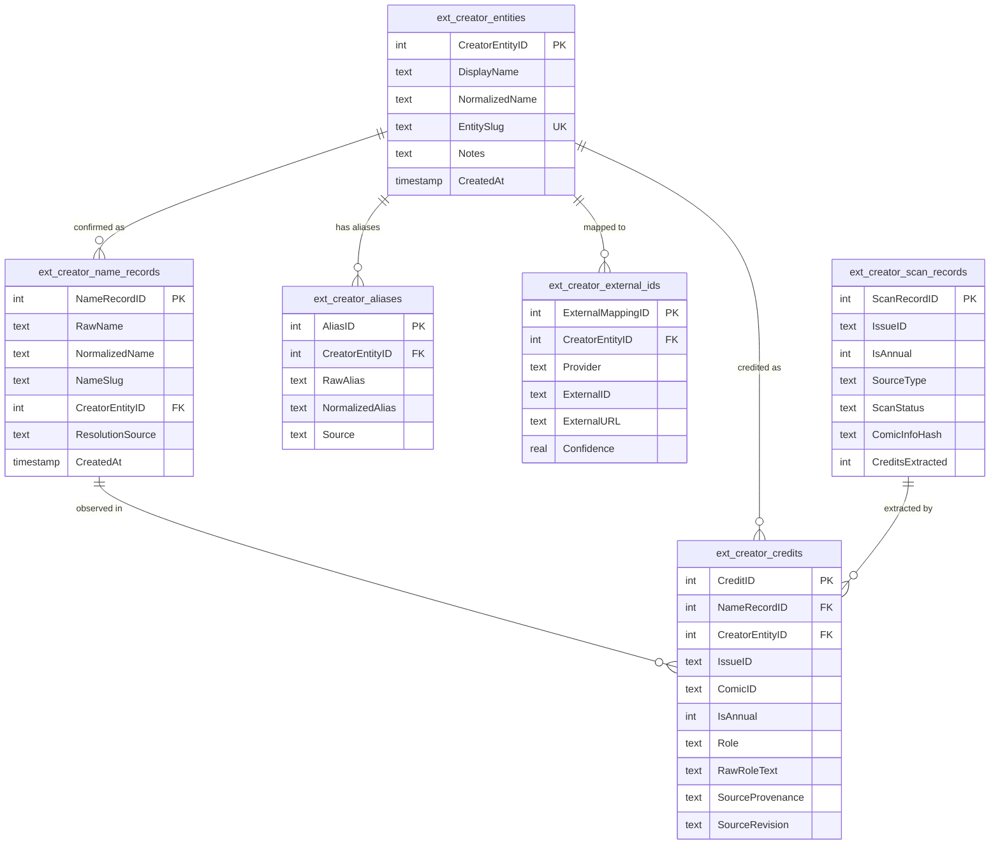
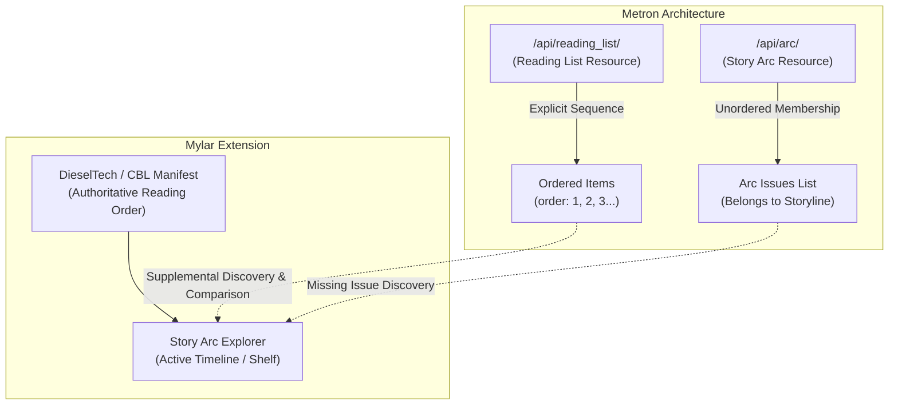

# Metron Capability, Provenance, and Operational Contract Audit (Phase C4)

> **Document Type**: Technical Capability, Provenance & Operational Contract Audit (Corrected)  
> **Status**: Authoritative / Read-Only  
> **Author**: Antigravity Assistant  
> **Audit Date**: 2026-08-23  
> **Primary References**: Metron Official API Documentation, Metron-Project/metron, Metron-Project/mokkari  
> **Scope**: Creator identity resolution, publication metadata enrichment, cross-provider reconciliation, Story Arc vs Reading List evaluation, rate limits, operational contracts, and modular architecture.

---

## 1. Executive Recommendation

Metron (`metron.cloud`) is a community-curated comic database providing a REST API for comic metadata. Based on this technical and operational audit of official Metron-Project sources, Metron offers a **viable, structured supplemental metadata source** for Mylar, particularly for:
1. **Granular, normalized creator credits** across standard industry roles.
2. **Cross-provider bridging** via native Grand Comics Database (`gcd_id`) and ComicVine (`cv_id`) foreign keys on series, issues, characters, teams, and arcs.
3. **Structured publication metadata** (variant cover distinction, store dates, rating classifications, and explicit imprint hierarchy).
4. **Supplemental Reading Lists** with explicit ordering and community attribution (e.g., CBRO).

However, Metron **must not be treated as a wholesale replacement for ComicVine or local `ComicInfo.xml`**. Metron must be integrated strictly under the project's **non-destructive, multi-provenance identity model** approved in Phase C1.1:
- **No Automatic Identity Merging**: Metron creator records must not automatically merge local raw name records (`ext_creator_name_records`) or create confirmed identities (`ext_creator_entities`) based solely on string matching, normalized slugs, or heuristics.
- **Explicit Confidence Tiers**: Only explicit cross-provider foreign key matches (e.g. verified `cv_id` equality) or explicit user confirmation may establish authoritative identity links.
- **Additive Provenance**: Metron metadata must persist in extension-owned structures with explicit `SourceProvenance = 'metron'` and source timestamping, never overwriting embedded local archive metadata or core ComicVine volume sync records.
- **Strict Read-Only & Rate-Limited Access**: Access must be gated behind user-configured credentials (stored server-side), token-bucket rate-limiting adhering to the official 20 req/min contract, persistent response caching, and explicit user-triggered operations.

**Conclusion**: Metron is operationally viable. The project is ready to proceed to **Phase C4.1 (Optional Credentials & Read-Only Connection Test)** following the strict implementation readiness contract specified in Section 15.

---

## 2. Source-Backed Operational Claims & Confidence Classification

Every operational claim in this audit is classified into one of three evidentiary categories:
1. **[Explicitly Documented]**: Directly stated in official Metron API documentation or official client specifications.
2. **[Observed in Official Source/Schema]**: Directly verified in official repository code, schema definitions, response fixtures, or model definitions in `Metron-Project/metron` or `Metron-Project/mokkari`.
3. **[Inferred / Verification Required]**: Deduced from standard API conventions or secondary tools; requires live verification during C4.1/C4.2.

---

## 3. Official-Source Bibliography

| Source Name | Canonical URL / Repository | Classification | Description & Coverage | Access Date |
| :--- | :--- | :---: | :--- | :--- |
| **Metron API Specification** | `https://github.com/Metron-Project/metron/blob/master/api/README.md` | Primary / Official | Official API endpoint listing, query parameters, authentication, and response formats. | 2026-08-23 |
| **Metron Project Core** | `https://github.com/Metron-Project/metron` | Primary / Official | Django data models, serializers, endpoints (`arc`, `reading_list`, `creator`, `role`, `issue`, `series`). | 2026-08-23 |
| **Mokkari Python Client** | `https://github.com/Metron-Project/mokkari` | Primary / Official | Official Metron API Python wrapper; rate-limit header parsing (`X-RateLimit-*`), error handling (`RateLimitError`), session pooling. | 2026-08-23 |
| **Metron Tagger Project** | `https://github.com/Metron-Project/metron-tagger` | Primary / Official | CLI archive tagger demonstrating Token authentication and ComicInfo generation. | 2026-08-23 |
| **ComicTagger Metron Talker** | `https://github.com/comictagger/metron_talker` | Secondary / Client | Plugin implementation demonstrating DRF pagination and header inspection. | 2026-08-23 |

---

## 4. Operational API Contract

### 4.1 Authentication Contract
- **Supported Methods**:
  - **Bearer / API Token Authentication** `[Explicitly Documented]`: `Authorization: Token <token>` (or `Authorization: Bearer <token>`). Tokens are generated via user account settings on `metron.cloud`.
  - **HTTP Basic Authentication** `[Explicitly Documented]`: `Authorization: Basic <base64(username:password)>`.
- **Recommended Method**: **Bearer / API Token Authentication** is the recommended method in official project tools (`metron-tagger`) as it eliminates persistent username/password transmission and enables scoped revocation.
- **Security & Lifecycle Rules**:
  - Credentials must remain strictly **server-side** in local `config.ini` or secure keyring.
  - Credentials must **never** be passed in query parameters, logged in exception traces, embedded in HTML templates, or exposed in client JSON responses.
  - On authentication failure (HTTP `401 Unauthorized` or `403 Forbidden`), the client must **immediately halt** and report authentication failure without retrying.

### 4.2 Rate Limiting & Concurrency Contract
- **Fixed Rate Limit** `[Explicitly Documented]`: **20 requests per minute** (approximately 1 request every 3 seconds).
- **Daily Quotas** `[Explicitly Documented]`: Standard user baseline is **5,000 requests per day** (donor tiers can scale up to 25,000 requests per day).
- **Response Headers** `[Observed in Official Source/Schema]`:
  - `X-RateLimit-Limit`: Maximum requests permitted in current window.
  - `X-RateLimit-Remaining`: Requests remaining in current window.
  - `X-RateLimit-Reset`: UTC epoch timestamp or seconds until current window resets.
- **HTTP 429 Handling & Backoff**:
  - Upon receiving HTTP `429 Too Many Requests`, the client must read the `Retry-After` header (or `X-RateLimit-Reset`), pause execution, and serialize subsequent requests.
  - Concurrency must be strictly bounded (single-threaded serialized queue recommended for Metron operations in Mylar).
  - Exponential backoff with jitter must be applied for temporary 5xx errors.

### 4.3 Pagination Contract
- **Pagination Mechanism** `[Observed in Official Source/Schema]`: Standard Django REST Framework (DRF) Page Number pagination.
- **Request Parameter**: `?page=<int>` (1-indexed). (Blanket `limit`/`offset` claims are incorrect).
- **Response Envelope**:
  ```json
  {
    "count": 1420,
    "next": "https://metron.cloud/api/issue/?page=2",
    "previous": null,
    "results": [ ... ]
  }
  ```
- **Page Size**: Default page size is 20 items per page. (Custom page sizing via `page_size` parameter requires live verification during C4.2).

### 4.4 Incremental Filtering & Conditional Requests
- **Date Filtering** `[Observed in Official Source/Schema]`: List endpoints support `?modified_gt=<ISO-8601-timestamp>` (e.g. `?modified_gt=2026-01-01T00:00:00Z`) for retrieving records modified after a given timestamp.
  - *Correction*: Unsupported query parameters `modified_since` and `last_updated` are discarded.
- **Conditional Requests** `[Observed in Official Source/Schema]`: Detail endpoints (`/api/issue/{id}/`, `/api/series/{id}/`) return `Last-Modified` headers and support `If-Modified-Since` headers, returning HTTP `304 Not Modified` when cached data is fresh.

---

## 5. Existing Local Creator Architecture

### 5.1 Table Purpose & Ownership

The creator subsystem implemented in Phase C2 and browsed in Phases C3–C3.2 is entirely extension-owned and isolated in `mylar/extensions/migrations/versions/creators.py`.



| Table Name | Classification | Architectural Purpose |
| :--- | :--- | :--- |
| `ext_creator_name_records` | **Raw Observations** | Stores distinct, immutable observed credit strings extracted from files/providers. `NameRecordID` is the authoritative browsing identity for unlinked credits. |
| `ext_creator_entities` | **Confirmed Identities** | Represents distinct, confirmed real-world human creator identities. Never populated automatically by string similarity. |
| `ext_creator_aliases` | **Aliases & Variations** | Records known alternate spellings, pen names, or misspellings confirmed to belong to a specific `CreatorEntityID`. |
| `ext_creator_external_ids` | **Provider Identifiers** | Provider-neutral mapping table linking a confirmed `CreatorEntityID` to third-party IDs (`Provider='comicvine'`, `Provider='metron'`, `Provider='gcd'`). |
| `ext_creator_credits` | **Publication Credits** | Relational junction linking an observed credit (`NameRecordID`) or confirmed entity (`CreatorEntityID`) to an `IssueID`/`ComicID` with exact role, sort order, and provenance. |
| `ext_creator_scan_records` | **Scan Provenance** | Tracks file-level scan status, mtime, file size, hash signatures, and extraction counts for cache invalidation. |

### 5.2 Schema Readiness & Migration Qualification
- **Phase C4.1 (Connection Test)**: **Zero schema changes required**. Connection test is stateless and does not persist records.
- **Phase C4.2 (Single-Record Comparison)**: **Zero schema changes required**. Comparison is rendered in-memory in the client modal.
- **Future Persistent Synchronization**:
  - Existing tables (`ext_creator_external_ids`, `ext_creator_credits`) already support `Provider='metron'` and `SourceProvenance='metron'`.
  - However, persistent HTTP response caching, sync cursors, or provider audit logs may require a dedicated extension-owned migration (e.g. `ext_metron_cache` or `ext_provider_sync_state`) upon future design approval.

---

## 6. Metron Resource & Identifier Inventory

| Resource Type | Metron Endpoint | Key Fields | Cross-Provider IDs Exposed | Evidence Status |
| :--- | :--- | :--- | :--- | :---: |
| **Creator / Person** | `/api/creator/` | `id`, `name`, `birth`, `death`, `alias`, `desc`, `image` | `cv_id` (ComicVine), `gcd_id` (GCD) | [Observed in Source] |
| **Series** | `/api/series/` | `id`, `name`, `year_began`, `year_end`, `volume`, `publisher`, `desc` | `cv_id`, `gcd_id` | [Observed in Source] |
| **Issue** | `/api/issue/` | `id`, `number`, `title`, `cover_date`, `store_date`, `price`, `sku`, `upc`, `page` | `cv_id`, `gcd_id`, `isbn`, `upc` | [Observed in Source] |
| **Publisher** | `/api/publisher/` | `id`, `name`, `founded`, `desc`, `image` | `cv_id`, `gcd_id` | [Observed in Source] |
| **Imprint** | `/api/imprint/` | `id`, `name`, `publisher` (FK to parent), `desc` | `cv_id`, `gcd_id` | [Observed in Source] |
| **Role** | `/api/role/` | `id`, `name` | Immutable system lookup | [Observed in Source] |
| **Character** | `/api/character/` | `id`, `name`, `alias`, `desc`, `image` | `cv_id`, `gcd_id` | [Observed in Source] |
| **Team** | `/api/team/` | `id`, `name`, `desc`, `image` | `cv_id`, `gcd_id` | [Observed in Source] |
| **Story Arc** | `/api/arc/` | `id`, `name`, `desc`, `image` | `cv_id`, `gcd_id` | [Observed in Source] |
| **Reading List** | `/api/reading_list/`| `id`, `name`, `desc`, `public`, `list_type`, `publisher`, `rating`, `source` | Community attribution (e.g. CBRO) | [Observed in Source] |

---

## 7. Creator-Role Fidelity & Non-Destructive Ingestion

Metron issues link creators through credit junction objects containing `creator` (FK/object), `role` (FK/name), and optional cover flags.

### 7.1 Confirmed vs Unverified Roles
- **Confirmed Primary Roles** `[Observed in Source/Schema]`:
  - `Writer`, `Script`, `Plot` → Map to canonical `writer` (preserving `RawRoleText`).
  - `Penciller`, `Pencils` → Map to canonical `penciller` (preserving `RawRoleText`).
  - `Inker`, `Inks` → Map to canonical `inker` (preserving `RawRoleText`).
  - `Colorist`, `Colors` → Map to canonical `colorist` (preserving `RawRoleText`).
  - `Letterer`, `Letters` → Map to canonical `letterer` (preserving `RawRoleText`).
  - `Editor`, `Editing`, `Assistant Editor` → Map to canonical `editor` (preserving `RawRoleText`).
  - `Cover`, `Cover Artist`, `Variant Cover` → Map to canonical `cover_artist` with `IsCover=1`.
- **Specialized Roles** `[Observed in Source/Discussions]`:
  - `Consulting Writer`, `Translator`, `Production`, `Designer`.
- **Unverified Roles**: Any role not verified in official schema is marked as **[Verification Required during C4.2]**.

### 7.2 Lossless Mapping Policy
1. **Raw Role Preservation**: Always record the exact string returned by Metron in `ext_creator_credits.RawRoleText`.
2. **Controlled Canonical Role**: Assign standard `Role` enum (`writer`, `penciller`, `inker`, `colorist`, `letterer`, `editor`, `cover_artist`, `other`) for sorting and display.
3. **Compound Expansion**: If a composite role is encountered (e.g. "Writer/Artist"), create distinct credit rows for each canonical role while retaining the composite string in `RawRoleText`.
4. **No Premature Normalization**: Do not hardcode unconfirmed normalization rules until live enumeration in C4.2.

---

## 8. Field-by-Field Metadata Authority Matrix

| Metadata Field | Local `ComicInfo.xml` | Current Mylar SQLite | ComicVine | Metron | Recommended Display Source | Recommended Identity Authority | Conflict Policy | Persistence Target |
| :--- | :--- | :--- | :--- | :--- | :--- | :--- | :--- | :--- |
| **Series Title** | Secondary observation | Primary series title | Authoritative for CV series | Clean, standardized series name | Current Mylar / ComicVine | ComicVine `ComicID` / Metron `series_id` | User preference / Keep ComicVine as base | `comics.ComicName` |
| **Start Year / Volume** | Embedded year | Core series start year | Volume publication year | Series start year | ComicVine / Metron | Matched volume year | Flag year discrepancies | `comics.ComicYear` |
| **Issue Number** | Embedded issue num | Canonical issue num | Issue number | Issue number | Core Mylar SQLite | Exact string match | Mylar issue format | `issues.Issue_Number` |
| **Issue Title** | Embedded story title | Issue title | Story/issue title | Story/issue title | Metron / ComicVine | ComicVine / Metron | Prefer non-empty title | `issues.IssueName` |
| **Publisher** | Embedded publisher | Publisher string | Publisher entity | Canonical publisher | ComicVine / Metron | Publisher entity ID | Normalize imprint vs publisher | `comics.ComicPublisher` |
| **Imprint** | Imprint tag (if present) | Often unpopulated | Often collapsed | Explicit `imprint` object | Metron | Metron Imprint ID | Display imprint under publisher | Extension metadata |
| **Store / Release Date** | Embedded date | `IssueDate` | `store_date` / `cover_date` | `store_date` / `cover_date` | Metron / ComicVine | ISO-8601 store date | Prefer verified store date | `issues.ReleaseDate` |
| **Page Count** | Embedded page count | Often null | Sometimes present | Frequently verified | `ComicInfo.xml` (physical file) | Physical archive stream | Prefer physical file page count | `issues.PageCount` |
| **Description / Summary** | Embedded summary | Core issue summary | HTML issue summary | Markdown / text summary | Metron / ComicVine | ComicVine / Metron | Clean text without HTML cruft | `issues.Summary` |
| **Creator Credits** | Raw embedded tags | Legacy string column | Web credits list | Structured creator junction | Locally indexed ComicInfo / Metron | Verified Creator Entity ID | Multi-provenance additive display | `ext_creator_credits` |
| **Variant Covers** | Embedded variant tag | Not modeled | Not structured | Structured variant list | Metron | Metron Issue Variant ID | Secondary disclosure / gallery | Extension metadata |
| **Story Arcs** | Embedded `<StoryArc>` | `storyarcs` table | Arc entity | Arc entity | CBL reading list / Curated | User-curated CBL manifest | Arc naming guidance only | `ext_cbl_*` / `storyarcs` |
| **Reading Lists** | Not present | Not modeled | Not modeled | Ordered list with `order` | Curated CBL / Metron list | User-curated CBL manifest | Supplemental comparison | `ext_cbl_*` / Extension |
| **External IDs** | None | CV IDs only | CV ID | `cv_id`, `gcd_id`, `upc`, `isbn` | Cross-provider composite | Verified foreign keys | Additive storage | `ext_creator_external_ids` |

---

## 9. Cross-Provider Identity Policy

Linkage between Metron and Mylar is strictly divided into three confidence tiers to prevent erroneous automated merges:

```mermaid
flowchart TD
    subgraph Tier A [Tier A: Authoritative - Auto-Linkable]
        A1[Explicit cv_id Match on Issue/Series]
        A2[Confirmed External ID on Creator Entity]
        A3[Explicit User Confirmation via UI]
    end

    subgraph Tier B [Tier B: Candidate Only - Review Required]
        B1[Exact Series Name + Year + Issue Number]
        B2[Exact Creator Name + Publication Concordance]
        B3[ISBN / UPC Barcode Match]
    end

    subgraph Tier C [Tier C: Rejected / Ambiguous - Discard / Flag]
        C1[Normalized Name / Slug Match Alone]
        C2[Single Surname / Partial Match]
        C3[Ambiguous Multi-Creator Hit]
    end

    Tier A -->|Safe to Persist| DB[(ext_creator_external_ids)]
    Tier B -->|Present to User| UI[Candidate Resolution Modal]
    Tier C -->|Do Not Suggest| Log[Log Ambiguity / Discard]
```

### 9.1 Tier A — Authoritative (Automatic Persistence Allowed)
1. **Explicit Cross-Provider Foreign Key Match**: Metron issue/series explicitly supplies `cv_id` matching Mylar's `issues.IssueID` or `comics.ComicID`.
2. **Pre-Existing Confirmed Mapping**: `ext_creator_external_ids` already contains verified `(Provider='metron', ExternalID=X)` linked to `CreatorEntityID`.
3. **Explicit User Linkage**: User confirms a candidate match via the UI.

### 9.2 Tier B — Candidate Only (Explicit User Review Required)
1. **Multi-Field Publication Concordance**: Exact matching series title + exact start year + exact issue number + release date within ±14 days (where `cv_id` is omitted in Metron).
2. **Creator Publication Concordance**: Exact `RawName` match where the creator is credited on the exact same verified series/issue in both systems.
- **Rule**: Tier B candidates may be presented for user review, but **must never automatically create or merge `ext_creator_entities`**.

### 9.3 Tier C — Rejected or Ambiguous (Discard / Suppress)
1. **Name/Slug Similarity Alone**: Matches based solely on normalized name (`NormalizedName`) or URL slug (`NameSlug`).
2. **Homonyms and Surnames**: Matches on common surnames or abbreviated initials.
3. **Punctuation or Suffix Inconsistencies**: Treating `Mike Deodato` as `Mike Deodato Jr.` without manual review.

---

## 10. Provenance and Conflict Model

1. **Zero Destructive Overwrites**: Metron data must never overwrite existing local `ComicInfo.xml` extractions or core ComicVine sync records.
2. **Multi-Provenance Storage**: Every credit record in `ext_creator_credits` retains its `SourceProvenance` (`'comicinfo'`, `'metron'`, `'comicvine'`) and `SourceRevision`.
3. **Unified Display Hierarchy**:
   - Primary view presents locally indexed physical archive credits (ground truth of downloaded files).
   - Enriched/verified metadata from Metron is displayed alongside confirmed entity badges.
   - Unmatched provider credits are preserved in accessible `<details>` disclosures.
4. **Re-Indexing Resilience**: When an archive is rescanned or modified, only its `SourceProvenance='comicinfo'` records are updated. Confirmed `ext_creator_entities` and `ext_creator_external_ids` remain linked and invariant.

---

## 11. Story Arcs Versus Reading Lists Audit

Metron provides two distinct concepts that must not be conflated:



### 11.1 Story Arc Resource (`/api/arc/`)
- **Concept**: Represents a thematic storyline or named crossover arc (e.g. *Court of Owls*, *Civil War*).
- **Structure**: Exposes `id`, `name`, `desc`, `image`, `cv_id`, `gcd_id`, and a collection of associated issues.
- **Reading Order**: **Unordered / Linear**. Does not provide an authoritative multi-series reading sequence across disparate publications.
- **Mylar Applicability**: Useful for discovering missing issue candidates belonging to a storyline and cross-referencing arc descriptions.

### 11.2 Reading List Resource (`/api/reading_list/`)
- **Concept**: Explicitly ordered reading progression across multiple series, one-shots, and annuals.
- **Documented Capabilities** `[Observed in Source/Schema]`:
  - **Ordering**: Each item in the list includes an explicit integer `order` field (e.g. `order: 1`, `order: 2`).
  - **Visibility**: Supports `public` (boolean) to distinguish curated public reading orders from private user lists.
  - **Classification**: Supports `list_type` (e.g. event, character progression, publisher timeline), `publisher`, and `rating`.
  - **Attribution & Sources**: Captures community attribution, including partnerships and imports from **Comic Book Reading Orders (CBRO)**.
  - **Pagination**: Results and list items are paginated via DRF `page`.
- **Product Policy Clarification**:
  - **DieselTech CBL manifests remain Mylar's primary and preferred curated reading-order authority**.
  - Metron Reading Lists provide a valuable **supplemental source for reading-order comparison, candidate discovery, and cross-reconciliation**, rather than an automatic replacement for local CBL files.

---

## 12. Representative Local Sample Analysis

Using read-only data from the current isolated staging environment:

| Sample Category | Representative Local Record | Local Identifiers Present | Required Evidence for Metron Linkage | Expected Failure / Ambiguity Mode |
| :--- | :--- | :--- | :--- | :--- |
| **Exact Simple Name** | `Frank Cho` (`NameRecordID: 1`) | `RawName='Frank Cho'`, `Fight Girls #1` (`ComicID: 137417`, `IssueID: 868995`) | `GET /api/creator/?name=Frank+Cho` → Verify credit on *Fight Girls* | Low risk; common name homonym collision checked via bibliography. |
| **Suffix Name** | `Mike Deodato Jr.` (`NameRecordID: 12`) | `RawName='Mike Deodato Jr.'`, `Fight Girls #1` | Verify Metron stores `Mike Deodato Jr.` vs `Mike Deodato` with distinct `id` | Suffix stripping in third-party databases causing false identity collapse. |
| **Case Variant** | `FRANK CHO` (`NameRecordID: 89`) | `RawName='FRANK CHO'`, unlinked record | Match exact normalized form to confirmed `Frank Cho` entity via explicit user approval | False assumption that case variance alone guarantees distinct human identity. |
| **Composite Credit** | `Scott Snyder and Nick Dragotta` (`NameRecordID: 104`) | `RawName='Scott Snyder and Nick Dragotta'` | Metron returns two distinct creator objects (`Scott Snyder`, `Nick Dragotta`) | Splitting composite credit must link both entities without destroying raw name record. |
| **Multi-Role Creator** | `Frank Cho` (Writer, Penciller, Inker, Cover) | 4 credit rows on `IssueID: 868995` | Metron issue credits include all 4 roles with separate `role_id`s | Role mapping discrepancies (e.g. "Writer/Artist" vs separate "Writer" + "Penciller"). |
| **Annual Issue** | `Batman: The Dark Knight Annual #1` (`IssueID: 358819`, `IsAnnual: 1`) | `ComicID: 42719`, `IssueID: 358819`, `IsAnnual=1` | Query Metron with `series_id` and issue number `Annual 1` or `cv_id=358819` | Annual numbering conventions (`Annual 1` vs `1` vs special series). |
| **Provider Difference** | `Sabine Rich` (Indexed) vs `Greg Land` (Provider-only) | Local index contains Sabine Rich; simulated provider diff contains Greg Land | Query Metron issue credits for both creators | Metron confirms Greg Land was variant cover artist not present in standard ComicInfo. |
| **Unindexed Issue** | `Batman #52` (`IssueID: 531238`) | 0 indexed credits; legacy metadata present | Query Metron via `cv_id=531238` to fetch complete creator credits | Network failure or unmapped CV ID in Metron database. |

---

## 13. Minimal Modular Integration Design

To preserve strict codebase modularity, any future Metron implementation must reside entirely within an extension directory: `mylar/extensions/providers/metron/`.

```text
mylar/extensions/providers/metron/
├── __init__.py           # Package entry point and exports
├── client.py             # HTTP client with rate-limiting, retry, and token-bucket
├── auth.py               # Server-side credential validation and header generation
├── models.py             # Strongly typed Pydantic/dataclass response models
├── mapper.py             # Lossless field and role mapping to canonical schema
├── reconciler.py         # Confidence tier evaluation (Tier A / Tier B / Tier C)
├── service.py            # Extension service layer orchestrating DB and cache
└── controller.py         # Web controller handling thin JSON API endpoints
```

### Modular Isolation Boundaries
- **Zero Core Pollution**: Core Mylar (`mylar/webserve.py`, `mylar/updater.py`, `mylar/helpers.py`) only receives thin route delegates.
- **Provider Pluggability**: If Metron is disabled or unconfigured, the creator subsystem and Story Arc Explorer continue operating seamlessly on local `ComicInfo.xml` and ComicVine data.
- **Zero Physical Archive Writes**: The Metron provider module has zero write access to comic archives (`.cbz`/`.cbr`).

---

## 14. Risk Register

| Risk ID | Risk Description | Severity | Likelihood | Mitigation Strategy |
| :--- | :--- | :---: | :---: | :--- |
| **R1** | **Automated Homonym Merge**: Distinct creators with identical names merged into one entity. | **High** | Medium | Strict Tier A/B policy: zero automated entity merges; require explicit user review for Tier B. |
| **R2** | **Rate Limit Exceeded (HTTP 429)**: High-volume queries exceed 20 req/min limit. | **High** | Low | Token-bucket rate limiter (20 req/min), persistent SQLite cache (7-day detail TTL), zero bulk library scans. |
| **R3** | **Archive / Tag Mutation**: Provider sync modifies physical `.cbz` files or tags without consent. | **High** | Zero | Strict architectural boundary: Metron module has zero write access to file archives. |
| **R4** | **Credential Exposure**: API token stored insecurely or leaked to browser. | **Medium** | Low | Credentials stored only in local server `config.ini`; never serialized in client JSON responses. |
| **R5** | **Upstream Schema Drift**: Metron API changes response keys or deprecates endpoints. | **Medium** | Low | Strongly typed Pydantic models with schema validation and fallback error logging. |
| **R6** | **ComicVine Sync Interference**: Metron sync conflicts with core ComicVine series tracking. | **Medium** | Zero | Metron data stored strictly in `ext_*` tables; core `comics` and `issues` tables remain ComicVine-governed. |

---

## 15. C4.1 Implementation Readiness Contract

When the project transitions to Phase C4.1 (Optional Credentials & Read-Only Connection Test), implementation must strictly adhere to the following contract:

1. **Extension Directory**: All code must reside exclusively in `mylar/extensions/providers/metron/`.
2. **Server-Side Authentication Abstraction**:
   - Primary: Bearer Token (`Authorization: Token <token>`).
   - Secondary / Fallback: HTTP Basic Auth.
   - Credentials stored in `config.ini`; strictly redacted from all logs, exception traces, UI templates, and JSON responses.
3. **Safe Connection-Probe Endpoint**:
   - Must execute a single, low-cost authenticated probe (e.g. `GET /api/publisher/` or `/api/role/` or `/api/user/` with `page=1`). The exact optimal probe endpoint will be confirmed during C4.1 implementation verification.
4. **Network & Client Hardening**:
   - Finite connection timeout (e.g. 5.0 seconds) and read timeout (e.g. 10.0 seconds).
   - Strict TLS certificate verification enabled.
   - Immediate termination (no retries) on HTTP `401 Unauthorized` or `403 Forbidden`.
   - Bounded backoff for HTTP `429` (respecting `Retry-After` / `X-RateLimit-Reset`) and transient 5xx errors.
   - Exposed status response returns boolean success, rate-limit quota remaining, and sanitized error messages.
5. **Strict Safety Invariants**:
   - **Zero Database Persistence**: The connection test must not write to any SQLite table.
   - **Zero Automatic Background Calls**: No calls triggered on normal page loads.
   - **Zero Entity Matching / Merging**: No creation of `ext_creator_entities` or linking of `ext_creator_name_records`.

---

## 16. Explicit Conclusion

### Verdict: Proceed to Phase C4.1 (Optional Credentials & Read-Only Connection Test)

The operational contract, rate limits (20 req/min), DRF pagination, token authentication, and separate Reading List vs Story Arc architectures are fully documented from official Metron sources.

The architecture is prepared for a safe, modular, read-only Phase C4.1 connection test.
