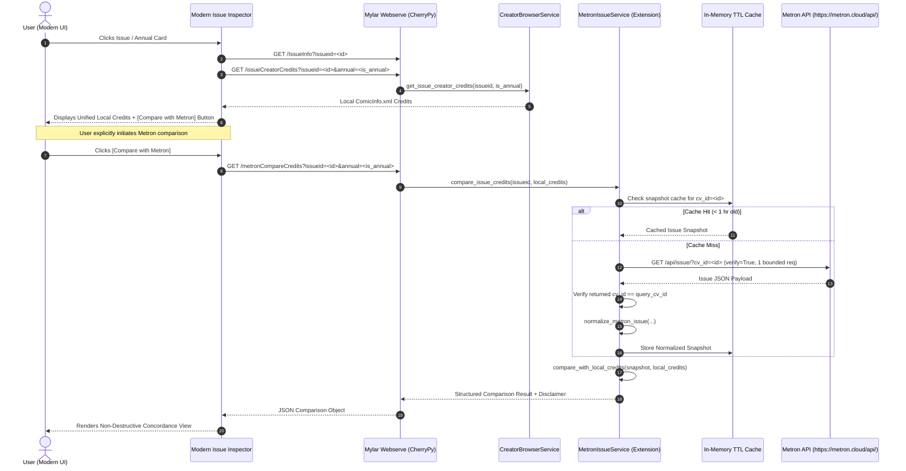
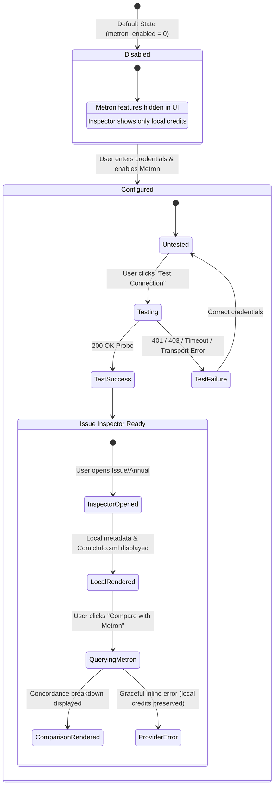

# Phase C4.3 — Metron Runtime Integration Boundary Design Document

**Status:** Implementation-Ready Technical Design (Read-Only Audit)  
**Target Package:** `mylar/extensions/providers/metron/`  
**Boundary Rules:** Zero database mutations, zero entity linking, zero live network requests on initialization, strict opt-in architecture.

---

## 1. Executive Recommendation

Metron should be integrated into Mylar as a **strictly opt-in, read-only supplemental metadata comparison provider**. 

To maximize safety, performance, and maintainability:
1. **Isolated Provider Boundary:** All Metron logic (HTTP client, credential resolution, response normalization, in-memory credit concordance, rate limiting, and caching) remains encapsulated in `mylar/extensions/providers/metron/`.
2. **Zero Schema or Identity Mutation:** Remote comparison operations are purely observational in memory. No SQLite tables, creator entities (`ext_creator_entities`), name records (`ext_creator_name_records`), aliases, external ID mappings, or comic archives are written or modified.
3. **Server-Side Secret Management:** Credentials are stored in `config.ini` under section `[Metron]`, defaulted to disabled (`METRON_ENABLED = False`), and never transmitted to the browser or logged.
4. **On-Demand User Invocation:** Metron queries are **never** executed automatically when browsing series or opening the Issue Inspector. Remote queries occur only when the user explicitly clicks `"Compare with Metron"`.
5. **In-Memory TTL Caching:** A lightweight, thread-safe in-memory cache with a 1-hour TTL protects Metron's ~20 req/min rate limit against rapid clicks, repeated modal toggles, and multi-issue inspection without requiring SQLite database migrations or disk I/O.

---

## 2. Current Configuration and Secret-Handling Map

### Existing Mylar Conventions
Mylar manages global runtime settings in `mylar.CONFIG` (defined in `mylar/config.py` and backed by `config.ini`).
- **Configuration Definitions:** Defined as tuples `(type, section, default)` in `mylar/config.py:__init__`.
- **Form Serialization:** `webserve.py:configUpdate()` receives POST data from `data/interfaces/default/config.html` (the shared settings template) and persists non-default values to `config.ini`.
- **Masking & Exposure:** Credentials like `COMICVINE_API`, `API_KEY`, `GIT_TOKEN`, and `NZB_PASSWORDS` are stored server-side. However, in legacy templates, some keys are directly rendered into HTML inputs (`value="${config['comicvine_api']}"`).

### Proposed Metron Configuration Schema
To prevent credential leaks and ensure backward compatibility for instances without Metron configured:

```ini
[Metron]
metron_enabled = 0
metron_auth_mode = token
metron_api_token = 
metron_username = 
metron_password = 
metron_base_url = https://metron.cloud/api/
```

| Config Attribute | Type | Default | Rationale |
| :--- | :--- | :--- | :--- |
| `METRON_ENABLED` | `bool` | `False` | Provider is disabled by default; prevents accidental network requests. |
| `METRON_AUTH_MODE` | `str` | `'token'` | Supports `'token'`, `'basic'`, and `'none'` per Mokkari API specification. |
| `METRON_API_TOKEN` | `str` | `None` | Primary Metron API bearer token. |
| `METRON_USERNAME` | `str` | `None` | Optional username for Basic Auth mode. |
| `METRON_PASSWORD` | `str` | `None` | Optional password for Basic Auth mode. |
| `METRON_BASE_URL` | `str` | `'https://metron.cloud/api/'` | Standard HTTPS base URL with strict HTTPS enforcement. |

### Secret Redaction Guarantees
- **No Query Strings:** Secrets are never sent via GET query parameters.
- **Redacted Representations:** `MetronCredentials.__repr__` masks all tokens and passwords as `[REDACTED]`.
- **Sanitized JSON Status:** Settings endpoints return boolean flags (`has_token: bool`, `has_password: bool`, `auth_mode: str`, `enabled: bool`) rather than plaintext secrets.
- **Log Sanitation:** All Metron log statements use `[METRON]` prefixes with credentials completely scrubbed.

---

## 3. Issue / Annual Identity-Flow Diagram



### Authoritative Issue Identifier Verification
1. **Regular Issues:** The `IssueID` column in the `issues` table is the positive integer ComicVine Issue ID (e.g. `105758`).
2. **Annuals:** The `IssueID` column in the `annuals` table is also the positive integer ComicVine Issue ID (e.g. `406949`).
3. **Validation Rule:** All incoming IDs are validated via `validate_comicvine_issue_id(issueid)`. Any non-positive, non-digit, or whitespace-padded string is immediately rejected with HTTP 400 without querying Metron.
4. **No Heuristic Lookups:** If an issue lacks a valid ComicVine IssueID, no secondary search by title, series, year, or issue number is performed.

---

## 4. Proposed Opt-In User Workflow



### State Matrix & Expected Behavior

| System State | Inspector UI Treatment | Network Activity | Data Safety |
| :--- | :--- | :--- | :--- |
| **Metron Not Configured / Disabled** | `"Compare with Metron"` button is hidden. Credits section displays local indexed credits only. | Zero remote calls. | Unaltered. |
| **Connection Test (Settings)** | Status badge shows `"Connecting..."` $\to$ `"Connection Successful"` or sanitized error message. | Exactly 1 connection probe request (`GET /api/issue/`). | Unaltered. |
| **Inspector Opened** | Local credits rendered immediately. Blue action badge `[ 🔍 Compare with Metron ]` displayed. | Zero remote calls on open. | Unaltered. |
| **User Clicks Compare** | Button changes to `[ ⏳ Querying Metron... ]` (disabled to prevent double-clicks). | Exactly 1 HTTP request (or 0 if cached). | Unaltered. |
| **Exact Overlap** | Creators appearing in both sources with matching roles display a green concordance badge. | None (processed in-memory). | Unaltered. |
| **Local Only** | Creators present in `ComicInfo.xml` but missing in Metron display standard blue chip. | None. | Unaltered. |
| **Metron Only** | Creators present in Metron but missing locally display an observational purple dashed chip. | None. | Unaltered. |
| **Role Discrepancy** | Displays role divergence badge (e.g. `Local: Editor | Metron: Writer`). | None. | Unaltered. |
| **Provider Error (404 / 429 / Timeout)** | Displays clean inline warning (e.g. *"No matching Metron record found"* or *"Rate limited"*). | None. | Local credits remain 100% visible. |

---

## 5. Backend and Interface Ownership Distinction

### Architecture Separation
```text
+-----------------------------------------------------------------------+
| Core Backend (mylar/config.py, mylar/webserve.py)                      |
| - Config definitions for METRON_*                                     |
| - Exposed route delegates: /testMetron, /metronCompareCredits         |
+-----------------------------------------------------------------------+
                                   |
                                   v
+-----------------------------------------------------------------------+
| Metron Extension Package (mylar/extensions/providers/metron/)          |
| - auth.py, client.py, service.py, normalizer.py, comparison.py        |
| - cache.py (in-memory TTL cache), issue_service.py, runtime_controller|
+-----------------------------------------------------------------------+
            |                                               |
            v                                               v
+------------------------------------+   +------------------------------------+
| Modern Interface (Primary Target)  |   | Classic & Carbon Interfaces        |
| - comicdetails_update.html         |   | - Untouched and unaffected         |
|   (Interactive Comparison UI)      |   | - Fallback settings template       |
| - style.css (Comparison Badges)    |   |   inherits global config safely    |
+------------------------------------+   +------------------------------------+
```

### Impact on Classic and Carbon Themes
- **Mako Template Fallback:** `webserve.py:serve_template` falls back to `data/interfaces/default/` if a template is missing in `modern/` or `carbon/`.
- **Zero Carbon / Classic Regressions:** Adding backend configuration fields and modern UI components does **not** break or require edits to `data/interfaces/default/` or `data/interfaces/carbon/`. Those interfaces continue to load normally without displaying the Modern-specific comparison buttons.

---

## 6. Rate Limiting and Cache Decision Matrix

| Cache Strategy | Rate Limit Protection | Multi-Process / Restart Behavior | Schema & Storage Impact | Maintenance & Upstream Complexity | Recommended? |
| :--- | :--- | :--- | :--- | :--- | :---: |
| **No Cache** | ❌ None. Rapid navigation or clicking easily triggers HTTP 429 rate limit (~20 req/min). | Stateless. | Zero. | Minimal. | ❌ No |
| **In-Memory TTL Cache (1 Hour TTL)** | ✅ **Optimal.** Fully protects against rapid clicks, repeated modal opens, and issue re-inspection. | Resets cleanly on Mylar restart. Process-local. | **Zero schema impact.** Pure in-memory dictionary with bounded size (max 500 entries). | **Lowest complexity.** Self-contained in extension package (`cache.py`). | **✅ YES (Recommended)** |
| **Persistent SQLite Table (`ext_metron_cache`)** | ✅ High protection across restarts. | Persistent across restarts. | Requires schema migration, periodic garbage collection, disk writes, and SQLite locking overhead. | High complexity. Creates database state for transient observational data. | ❌ No |

### Cache Implementation Specification (`mylar/extensions/providers/metron/cache.py`)
```python
class MetronSnapshotCache:
    """Thread-safe, in-memory LRU/TTL cache for normalized Metron issue snapshots."""
    def __init__(self, max_entries=500, ttl_seconds=3600):
        self._cache = {} # key: cv_id -> (timestamp, snapshot)
        self._max_entries = max_entries
        self._ttl = ttl_seconds
        self._lock = threading.Lock()

    def get(self, cv_id: int) -> dict | None: ...
    def set(self, cv_id: int, snapshot: dict) -> None: ...
    def clear(self) -> None: ...
```

---

## 7. Inspector Concurrency and Lifecycle Contract

The Modern Issue Inspector features rapid asynchronous navigation (Arrow Left/Right, Prev/Next buttons, and direct card clicks). The Metron comparison client must strictly respect this request lifecycle:

1. **Request Tracking (`_currentIssueRequestId`):**
   - Each Inspector open or navigation increments `_currentIssueRequestId`.
   - When a Metron comparison response returns, the frontend verifies:
     ```javascript
     if (thisReqId !== _currentIssueRequestId || _currentOpenIssueId != thisIssueId || _currentInspectorScope !== thisScope || !$('#issue-box').is(':visible')) {
         return; // Discard superseded response
     }
     ```
2. **Active Request Abort (`_activeMetronAjax`):**
   - If a Metron request is in flight when the user navigates or closes the modal, `_activeMetronAjax.abort()` is invoked immediately to release browser connections.
3. **No Retries on 4xx/5xx:**
   - Client errors (e.g. 404 Not Found, 401 Unauthorized) or server errors are treated as terminal for that session; no automatic background retry loops are launched.
4. **Scope Isolation:**
   - Issue (`scope='issues'`) and Annual (`scope='annuals'`) scopes are maintained independently to prevent cross-scope rendering.

---

## 8. Comparison Presentation Contract

The comparison view is rendered inside a progressive disclosure accordion within the unified `Credits` section:

```text
CREDITS
Local ComicInfo.xml · Metron Observational Comparison (cv_id: 868995)

CONCORDANT CREDITS (Present in both Local and Metron)
[ Writer: Frank Cho  ✓ Concordant ]  [ Colorist: Sabine Rich  ✓ Concordant ]

LOCAL ONLY (Present in ComicInfo.xml, absent in Metron)
[ Cover Artist: Frank Cho  Local ]

METRON ONLY (Reported by Metron, absent in ComicInfo.xml)
[ Letterer: Sal Cipriano  Metron (Observed) ]

ROLE DISCREPANCIES
• Frank Cho: Local reports 'Penciller', Metron reports 'Cover Artist'

PROVIDER NOTICES
• Metron issue snapshot cached for 1 hour.

ℹ️ Credit comparison is observational only. Matching names do not establish creator
   identity, and no creator records were linked or modified.
```

### Visual Token & Chip Styling
- **Concordant Chip:** Solid surface, emerald border, green checkmark badge (`badge-creator-concordant`).
- **Local-Only Chip:** Standard interactive Modern chip linking to `creator_detail?NameRecordID=...`.
- **Metron-Only Chip:** Dashed lavender border, non-clickable (no local NameRecordID exists), labeled `Metron`.
- **Disclaimer:** Prominently displayed at the foot of the comparison box in muted typography (`font-size: 0.8rem; color: var(--color-text-muted)`).

---

## 9. Security and Failure Contract

1. **HTTP Method Enforcement:**
   - **`POST /testMetron`**: Used for credential connection testing to ensure tokens/passwords never leak into server access logs, URL histories, or referrers.
   - **`GET /metronCompareCredits?issueid=...&annual=...`**: Used for read-only issue comparison (no credentials in request params).
2. **Strict TLS Verification:** All HTTPS requests enforce `verify=True` using standard CA certificates.
3. **Bounded Timeouts:** Connection timeout = 5.0s, Read timeout = 10.0s.
4. **Payload Bounding:** Response size capped at 2 MB to prevent memory exhaustion from rogue endpoints.
5. **Sanitized User Errors:** Provider exceptions are mapped to safe user messages:
   - `401 / 403` $\to$ `"Metron authentication failed. Please verify your API token in Settings."`
   - `404` $\to$ `"No Metron issue found matching ComicVine IssueID <id>."`
   - `429` $\to$ `"Metron request rate limit reached. Please wait a moment before trying again."`
   - `5xx / Transport` $\to$ `"Unable to connect to Metron API. Provider may be temporarily unavailable."`

---

## 10. Extension / Core File Ownership Matrix

```text
==============================================================================
FILE / PATH                                           OWNERSHIP & ROLE
==============================================================================
mylar/extensions/providers/metron/
  ├── __init__.py                                     Extension: Exports public APIs
  ├── auth.py                                         Extension: MetronCredentials
  ├── client.py                                       Extension: Hardened HTTPS client
  ├── service.py                                      Extension: Read-only probe service
  ├── normalizer.py                                   Extension: Role & Issue normalizer
  ├── comparison.py                                   Extension: Concordance comparison engine
  ├── issue_service.py                                Extension: Issue retrieval by CV ID
  ├── config.py                                       Extension: [NEW C4.4] Config loader
  ├── cache.py                                        Extension: [NEW C4.4] In-memory TTL cache
  └── runtime_controller.py                           Extension: [NEW C4.4] Route handlers

mylar/config.py                                       Core Hook: Declare METRON_* keys
mylar/webserve.py                                     Core Hook: Route delegates for endpoints
data/interfaces/default/config.html                   Core Template: Metron settings fields
data/interfaces/modern/comicdetails_update.html       Modern UI: Inspector comparison trigger
data/interfaces/modern/css/style.css                  Modern UI: Chip & badge CSS rules
scratch/test_phase_c4_3.py                            Test Suite: Integration verification
==============================================================================
UNTOUCHED SUBSYSTEMS:
  - mylar/db.py & SQLite database schemas             100% UNTOUCHED
  - ext_creator_* tables                              100% UNTOUCHED
  - ComicVine / MB / CV scrapers                      100% UNTOUCHED
  - Post-processing, cmtagmylar, and tagging          100% UNTOUCHED
  - Story Arcs & Reading Lists                        100% UNTOUCHED
  - Classic / Carbon templates                        100% UNTOUCHED
==============================================================================
```

---

## 11. Proposed Endpoint Contracts

### 1. `POST /testMetron`
- **Purpose:** Perform a single read-only probe to verify credentials.
- **Request Parameters:** Optional `token`, `username`, `password`, `auth_mode`, `base_url` (if testing unsaved form values). If omitted, loads from `mylar.CONFIG`.
- **Response Format (JSON):**
  ```json
  {
    "success": true,
    "status_code": 200,
    "auth_mode": "token",
    "base_url": "https://metron.cloud/api/",
    "message": "Successfully connected to Metron API.",
    "error_code": null
  }
  ```

### 2. `GET /metronCompareCredits`
- **Purpose:** Retrieve normalized Metron credits and compare against local indexed credits.
- **Request Parameters:**
  - `issueid`: Positive integer ComicVine Issue ID.
  - `annual`: `0` (regular issue) or `1` (annual).
- **Response Format (JSON):**
  ```json
  {
    "success": true,
    "issue_id": 868995,
    "is_annual": 0,
    "cached": true,
    "provider_snapshot": { ... },
    "exact_overlaps": [ ... ],
    "local_only_credits": [ ... ],
    "provider_only_credits": [ ... ],
    "role_discrepancies": [ ... ],
    "warnings": [],
    "disclaimer": "Credit comparison is observational only. Matching names do not establish creator identity, and no creator records were linked or modified."
  }
  ```

---

## 12. Phased Implementation Sequence

- **Phase C4.4 — Settings Integration & Connection Probe UI:**
  - Add `METRON_*` configuration definitions to `mylar/config.py`.
  - Add Metron configuration section and `"Test Connection"` button to Settings.
  - Add `POST /testMetron` route handler.
  - Unit tests verifying secret redaction and connection probe handling.
- **Phase C4.5 — Runtime Cache & Comparison Route:**
  - Implement `mylar/extensions/providers/metron/cache.py` (In-memory TTL cache).
  - Implement `GET /metronCompareCredits` in `mylar/extensions/providers/metron/runtime_controller.py`.
  - Wire route delegate into `mylar/webserve.py`.
  - Unit tests verifying cache hits, invalid ID rejections, and concordance output.
- **Phase C4.6 — Modern Issue Inspector Comparison Presentation:**
  - Add `"Compare with Metron"` button and progressive disclosure container to `comicdetails_update.html`.
  - Add comparison chip CSS styles to `style.css`.
  - Integrate request aborting and `_currentIssueRequestId` race protection.
  - Visual verification with Playwright desktop & mobile screenshots.

---

## 13. Risks and Mitigations

| Identified Risk | Severity | Mitigation Strategy |
| :--- | :---: | :--- |
| **Metron API Rate Limiting (HTTP 429)** | Medium | In-memory 1-hour TTL cache; on-demand user-triggered button (never query on scroll/open). |
| **Credential Leakage in UI or Logs** | High | Redacted `__repr__`, sanitized JSON status endpoints, server-side `config.ini` loading. |
| **Inspector Race Conditions on Fast Navigation** | Medium | Request ID guards (`_currentIssueRequestId`), AJAX abort handlers on modal close/navigation. |
| **Ambiguous or Unresolved Creator Overlap** | Low | Strict case-sensitive matching; unconfirmed roles map to `other`; observational disclaimer displayed. |
| **Staging DB Inadvertent Mutation** | Critical | Pure read-only design; all comparison done in memory; automated tests assert SQLite row counts before & after. |

---

## 14. Complete Next-Phase Implementation Prompt

```markdown
# Phase C4.4 — Metron Settings Integration and Connection Probe Route

Implement Phase C4.4 following the approved design in `metron_runtime_integration_design.md`.

## Scope & Deliverables
1. Declare optional `METRON_*` configuration keys in `mylar/config.py` (default `METRON_ENABLED = False`).
2. Add Metron Settings fields and "Test Connection" button to `data/interfaces/default/config.html` and `data/interfaces/modern/css/config.less`.
3. Implement `POST /testMetron` in `mylar/extensions/providers/metron/runtime_controller.py` and delegate in `mylar/webserve.py`.
4. Ensure all responses are sanitized JSON with zero secret exposure.
5. Create comprehensive test suite `scratch/test_phase_c4_4.py`.
6. Verify 100% database row count invariance.
```
